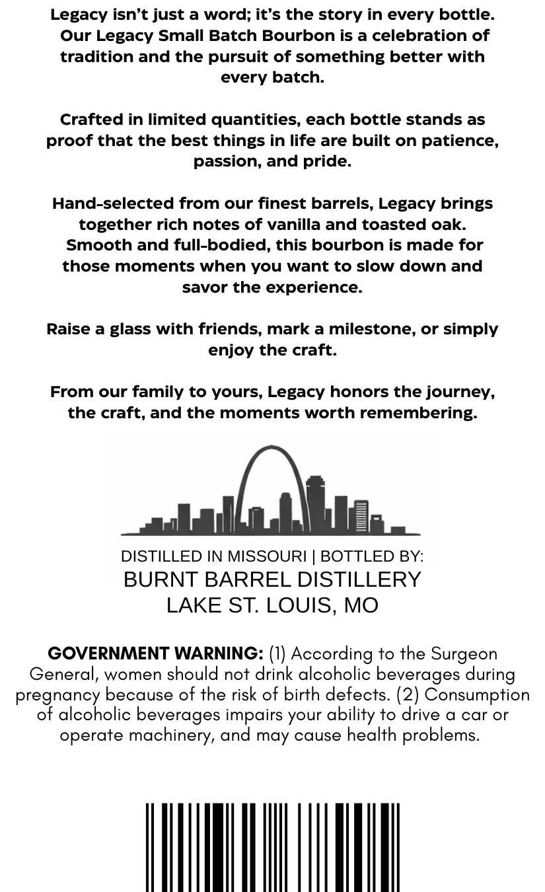
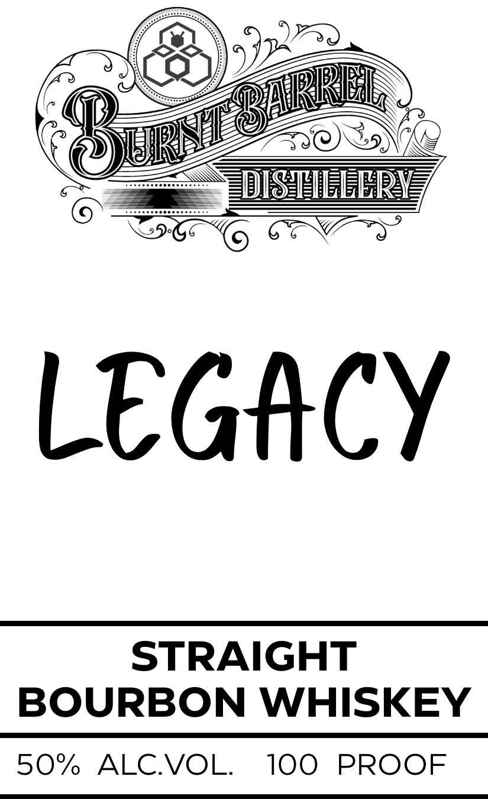

# TTB COLA Label Images - TTBID 26153001000377

**Brand Name:** BURNT BARREL DISTILLERY

**Fanciful Name:** LEGACY

**Issue Date:** 06/05/2026

**Origin Code:** 06

**Product Class/Type:** 101

**Source:** [TTB Public COLA Registry](https://ttbonline.gov/colasonline/viewColaDetails.do?action=publicFormDisplay&ttbid=26153001000377)

## Label Images

### Back Label

### Front Label

## Extracted Label Text

*Text extracted via OCR - may contain errors*

**Detected Proof:** 100

### Back Label

Legacy isn't just
word; it's the story in every bottle_
Our Legacy Small Batch Bourbon is a celebration of
tradition and the pursuit of something better with
every batch:
Crafted in limited quantities, each bottle stands as
proof that the best things in life are built on patience,
passion, and pride.
Hand-selected from our finest barrels; Legacy brings
together rich notes of vanilla and toasted oak:
Smooth and full-bodied, this bourbon is made
those moments when you want to slow down and
savor the experience:
Raise a glass with friends, mark a milestone, or simply
enjoy the craft
From our family to yours, Legacy honors the journey,
the craft, and the moments worth remembering:
DISTILLED IN MISSOURI
BOTTLED BY:
BURNT BARREL DISTILLERY
LAKE ST: LOUIS, MO
GOVERNMENT WARNING: (I) According to the Surgeon
General, women should not drink alcoholic beverages during
pregnancy because of the risk of birth defects. (2) Consumption
of alcoholic beverages impairs your
to drive a car or
operate machinery, and may cause health problems.
for
ability

### Front Label

LLER
LeG#CY
STRAIGHT
BOURBON WHISKEY
50%/
ALCVOL
100
PROOF
ARRRI
URnT
