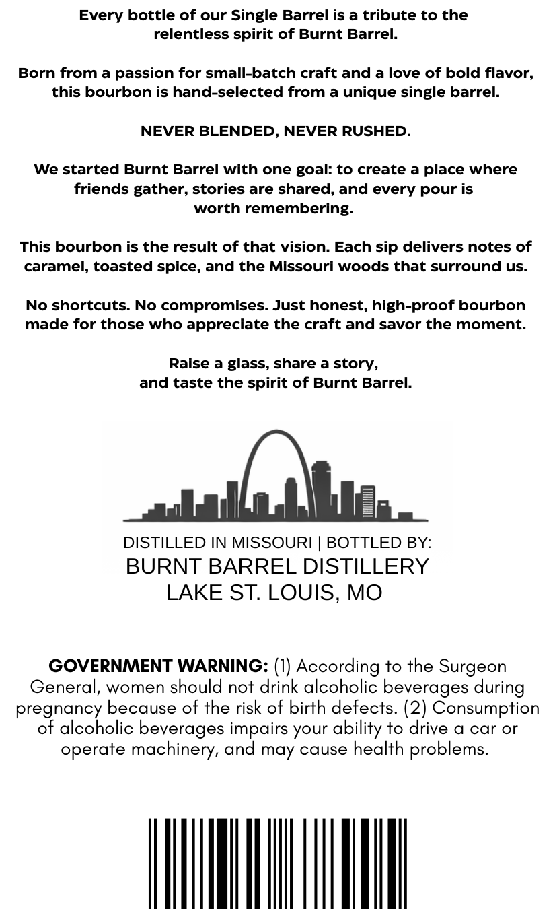
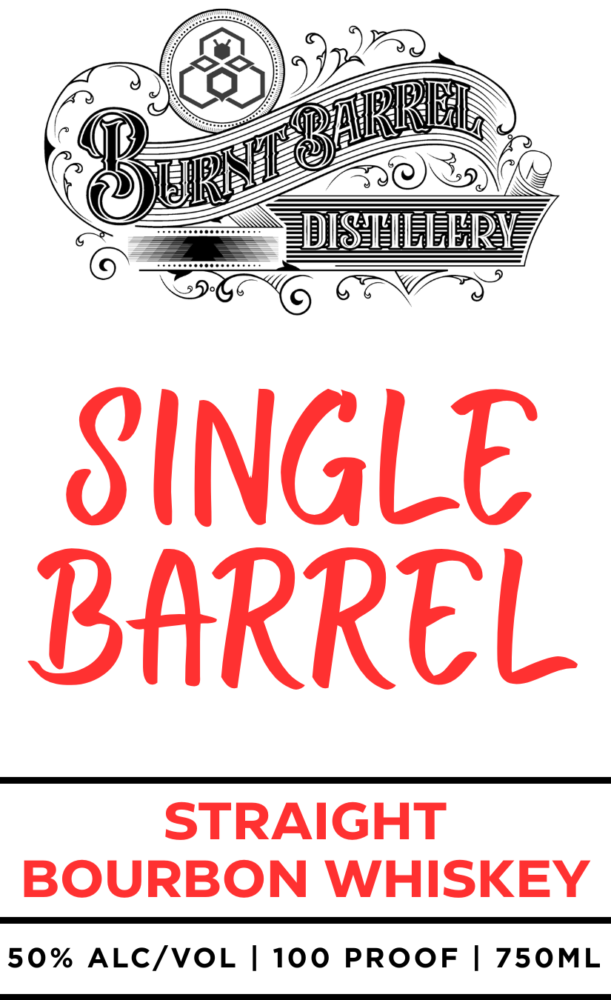

# TTB COLA Label Images - TTBID 26153001000387

**Brand Name:** BURNT BARREL DISTILLERY

**Fanciful Name:** SINGLE BARREL

**Issue Date:** 06/08/2026

**Origin Code:** 29

**Product Class/Type:** 101

**Source:** [TTB Public COLA Registry](https://ttbonline.gov/colasonline/viewColaDetails.do?action=publicFormDisplay&ttbid=26153001000387)

## Label Images

### Back Label

### Front Label

## Extracted Label Text

*Text extracted via OCR - may contain errors*

**Detected Proof:** 100

### Back Label

Every bottle of our Single Barrel is a tribute to the
relentless spirit of Burnt Barrel.
Born from a passion for small-batch craft and a love of bold flavor;
this bourbon is hand-selected from a unique single barrel:
NEVER BLENDED, NEVER RUSHED.
We started Burnt Barrel with one goal: to create a place where
friends gather, stories are shared, and every pour is
worth remembering:
This bourbon is the result of that vision: Each sip delivers notes of
caramel, toasted spice, and the Missouri woods that surround us.
No shortcuts No compromises. Just honest, high-proof bourbon
made for those who appreciate the craft and savor the moment
Raise
a glass, share
story,
and taste the spirit of Burnt Barrel:
DISTILLED IN MISSOURI
BOTTLED BY:
BURNT BARREL DISTILLERY
LAKE ST: LOUIS, MO
GOVERNMENT WARNING: (I) According to the Surgeon
General, women should not drink alcoholic beverages during
pregnancy because of the risk of birth defects: (2) Consumption
of alcoholic beverages impairs your
to drive a car or
operate machinery, and may cause health problems.
ability

### Front Label

LEiR
SINGLE
BARREl
STRAIGHT
BOURBON WHISKEY
50%
ALC/VOL
1
100
PROOF
750ML
ARRRI
URnT
