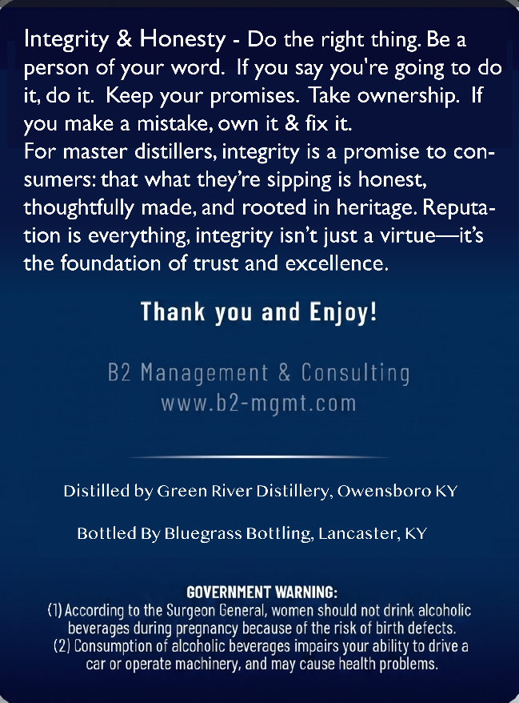
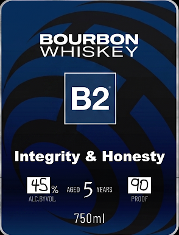

# TTB COLA Label Images - TTBID 26153001000610

**Brand Name:** B2 INTEGRITY & HONESTY

**Issue Date:** 06/10/2026

**Origin Code:** 22

**Product Class/Type:** 141

**Source:** [TTB Public COLA Registry](https://ttbonline.gov/colasonline/viewColaDetails.do?action=publicFormDisplay&ttbid=26153001000610)

## Label Images

### Back Label

### Front Label

## Extracted Label Text

*Text extracted via OCR - may contain errors*

### Back Label

Integrity & Honesty
Do the right thing: Be a
person of your word:
If you say
you're going to do
it, do it: Keep your promises  Take ownership: If
you make a mistake, own it & fix it:
For master distillers, integrity is a
promise to con-
sumers: that what theyre sipping is honest,
thoughtfully made, and rooted in heritage. Reputa-
tion is everything; integrity isn't just a virtue ~its
the foundation of trust and excellence.
Thank you and Enjoy!
B2 Management & Consulting
WWW .
b2-mgmt.com
Dislilled by Green River Dislillery, Owensboro KY
Bollled By Bluegrass Botlling, Lancasler, KY
GOVERNMENT WARNING:
According to the Surgeon General, women should not drink alcoholic
beverages during pregnancy because of the risk of birth defects
(2) Consumption of alcoholic beverages impairs your ability to drive a
car Or
operate machinery, and may cause health problems.

### Front Label

BOURBON
WHISKEY
B2
Integrity
Honesty
451%
AGED
5
YEAPRS
ALC BYVOL;
PROOF
750ml
