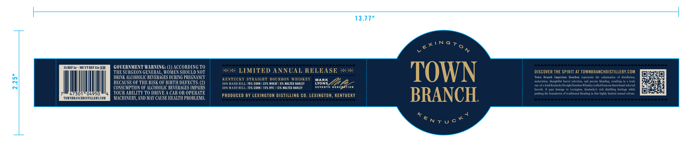
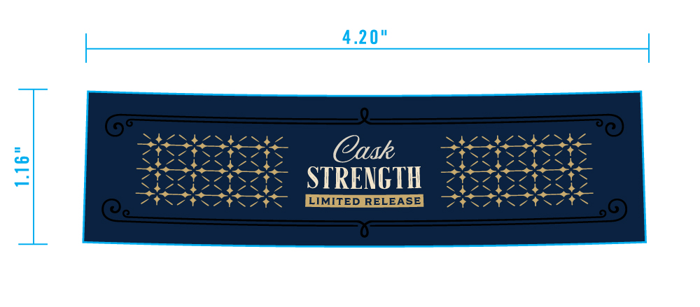
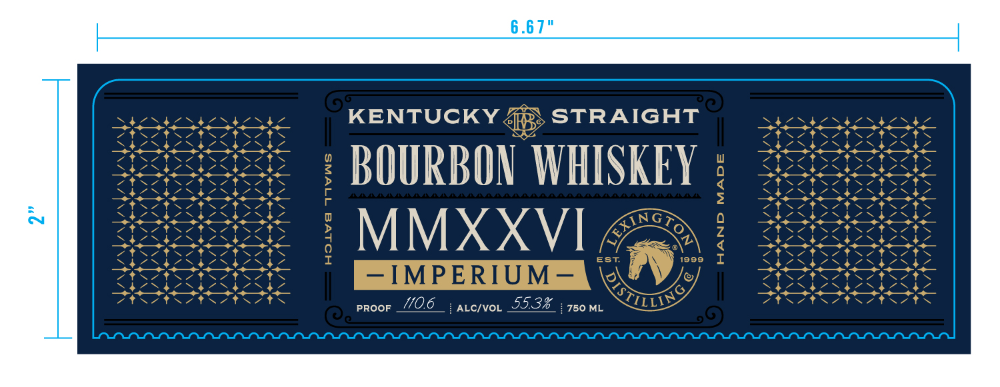

# TTB COLA Label Images - TTBID 26153001000650

**Brand Name:** TOWN BRANCH IMPERIUM

**Issue Date:** 06/10/2026

**Origin Code:** 22

**Product Class/Type:** 101

**Source:** [TTB Public COLA Registry](https://ttbonline.gov/colasonline/viewColaDetails.do?action=publicFormDisplay&ttbid=26153001000650)

## Label Images

### Label 1

### Label 2

### Label 3

## Extracted Label Text

*Text extracted via OCR - may contain errors*

### Label 1

13.77"
e*'NGTo
1
4[
M REF 5c
ME VT KEF I5c TTM
GOVERNMENT WARNING: (1) ACCORDING TO
THE SURGEON GENERAL, WOMEN SHOULD NOT
7 LIMITED ANNUAL RELEASE *x
TOWN
DISCOVER THE SPIRIT AT TOWNBRANCHDISTILLERY.COM
DRINK ALCOHOLIC BEVERAGES DURING PREGNANCY
KENTUCKY STRAIGHT BOURBON WHISKEY
Town
Branch   Imperium
Bourban   represents
thte   culminatian
distillaticn,
3
BECAUSE OF THE RISK OF' BIRTH DEFECTS: (2)
505 MASHI BILL: 70% CORN | 229 WHEAT | 8% MALTED BARLEY
WoRK
Ih 4
maturaliom; Ahoughtful harre| sclerticn; and
precise
blending, resulting
truly
one-uf-a-kind Kentueky Straight Fourbon Whiskeycrafted from our linest hand selected
CONSUMPTION OF ALCOTIOLIC BEVERAGES IMPATRS
505 MASH KILL: 723 CORM
153 RYE
13% MALTED BARLEY
SEvEnTH GEneaation
barrels
Wle
Iwutnage to Lexington, Kentucky $ rich   distilling heritage while
47301
04950
YOUR ABILITY TO DRIVE A CAR OR OPERATE
PRODUCED BY LEXINGTON diSTiLLiNG Co. LEXINGTON, KEnTUCKY
BRANCH
pushing the buundaries of traditional blending
this highly limited Anntal release
TOWNBRANCHDISTLLERE,COH
MACHINERY, AND MAy CAUSE HEALIH PROBLEMS.
3naaeeaaee
Saaaeaaeaeaae
tentuck

### Label 2

SESS ESI SA ZNS LNA ae
SRS Cush BOS
SHEERS S374 7 on
Hota STRENGTH TO IPE AE AOL AS
DEO RON TAN Fes
Ft tre eete ES

### Label 3

Siyassvanyosevaniy KENTUCKY 4 STRAIGHT Sicntestcsicsic
SESS «=: BOURBON WHISKEY : 22c3EE
SRSESESESE M MXXVI GEN (es se hee
PRA poor 06 scyvou 53% | mo, SUES? PAA
