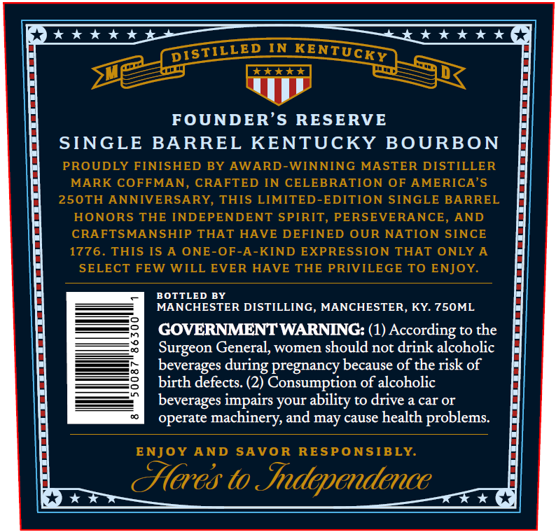
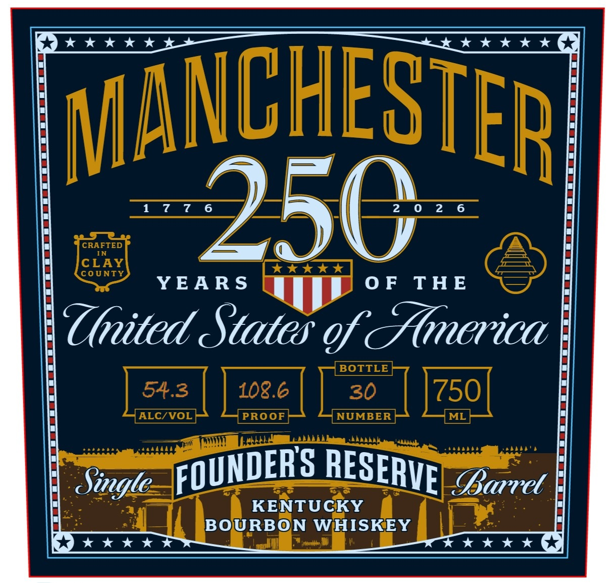

# TTB COLA Label Images - TTBID 26153001000742

**Brand Name:** FOUNDER'S RESERVE

**Issue Date:** 06/10/2026

**Origin Code:** 22

**Product Class/Type:** 141

**Source:** [TTB Public COLA Registry](https://ttbonline.gov/colasonline/viewColaDetails.do?action=publicFormDisplay&ttbid=26153001000742)

## Label Images

### Back Label

### Front Label

## Extracted Label Text

*Text extracted via OCR - may contain errors*

### Back Label

4 * * * *L
734**tt}
IN
344t
FOUNDER'S
RESERVE
SINGLE BARREL KENTUCKY BOURBON
PROUDLY FINISHED BY AWARD-WINNING MASTER DISTILLER
MARK COFFMAN, CRAFTED IN CELEBRATION OF AMERICA'S
250TH ANNIVERSARY, THIS LIMITED-EDITION SINGLE BARREL
HONORS THE INDEPENDENT SPIRIT
PERSEVERANCE
AND
CRAFTSMANSHIP THAT HAVE DEFINED OUR NATION SINCE
1776_
THIS IS A ONE-OF-A-KIND EXPRESSION THAT ONLY A
SELECT FEW WILL EVER HAVE THE PRIVILEGE TO ENJOY
BOTTLED BY
MANCHESTER DISTILLING, MANCHESTER, KY 750ML
GOVERNMENTWARNING: (1) According to the
Surgeon General, women should not drink alcoholic
beverages
pregnancy because of the risk of
birth defects: (2) Consumption of alcoholic
beverages impairs your ability to drive a car Or
operate machinery, and may cause health problems:
ENJOY AND
SAVOR
RESPONSIBLY
Ceres to Independence
DISTILLED
KENTUCKY
during

### Front Label

MANCHESTER
1  7 7 6
250
2 0  2 6
CRAFTED
IN
CLAY
43**
COUNTY
YEA R S
0 F
THE
United States of &merica
BOTTLE
54.3
108.6
30
750
ALCZVOL
PROOF
NUMBER
ML
Kea
Sigle
BBarret
KENTUCKY
BOURBON WHISKEY
FOUNDERS
RESERVE
