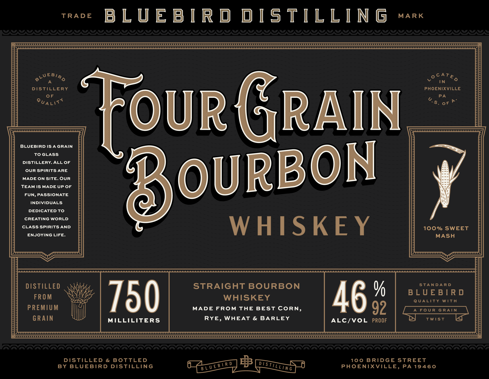
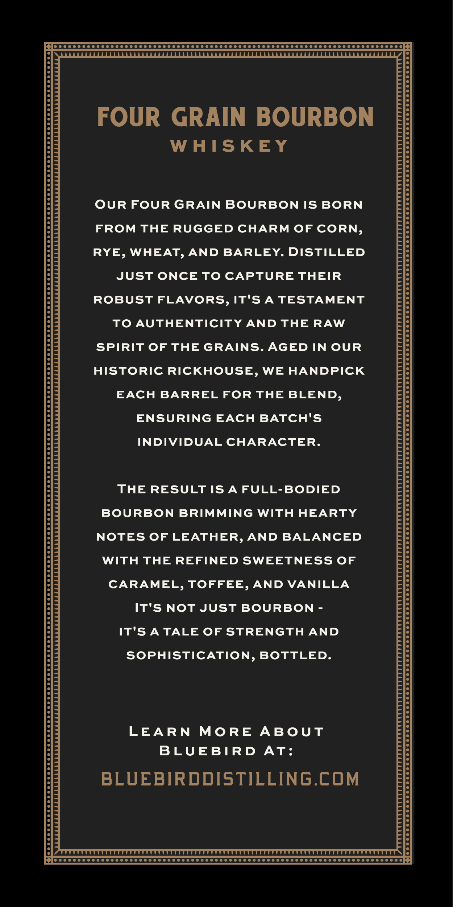
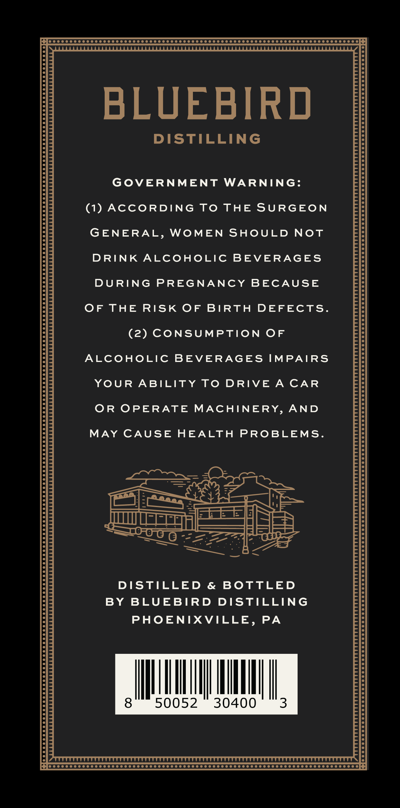

# TTB COLA Label Images - TTBID 26153001000761

**Brand Name:** BLUEBIRD DISTILLING

**Fanciful Name:** FOUR GRAIN BOURBON

**Issue Date:** 06/05/2026

**Origin Code:** 39

**Product Class/Type:** 101

**Source:** [TTB Public COLA Registry](https://ttbonline.gov/colasonline/viewColaDetails.do?action=publicFormDisplay&ttbid=26153001000761)

## Label Images

### Label 1

### Label 2

### Label 3

## Extracted Label Text

*Text extracted via OCR - may contain errors*

### Label 1

TRADE

MARK

BLUEBIRD DISTILLING

‘CO Gogoooooo

Teceseeseeeeeee

CoO

Teeseeeseese

Teeeseeeeeee

Teceseeeseseeee

Tesseeeseeeeeee

Teseeeseeeee

Deceeeeeeeee

OOO

oomnc:

WWEBIA,

A

yoc4Te,

IN

DISTILLERY

PHOENIXVILLE

OF

7

PA

Punt

:

S. oF ie

OUR (RAIN

BLUEBIRD ISAGRAIN

TOGLASS

DISTILLERY. ALL OF

OUR SPIRITS ARE

MADE ON SITE. OUR

TEAM IS MADE UP OF

FUN, PASSIONATE

OURBON

INDIVIDUALS

DEDICATED TO

CREATING WORLD

CLASS SPIRITS AND

100% SWEET

ENJOYING LIFE.

WHISKEY

MASH

STANDARD

DISTILLED

STRAIGHT BOURBON

FROM

4

%

BLUEBIRD

SW

UZTSSTI

WHISKEY

QUALITY WITH

PREMIUM

MADE FROM THE BEST CORN,

AG

92

GRAIN

RYE, WHEAT & BARLEY

DN

TWIST

Le

MILLILITERS

ALC/VOL PROOF

Blecccccccccccccccccccccccccccccecccsccsceeccsenesceseecces eee eeeeesaeeees eee eee see es esas eaeee sees eee eeeeesese ees eeseeeaeeeseeeseeseee ses eeneeeseeeeeeeesceseeeseeeeeseeseeseeeeeseeeesseeeeseeesccseeeceseeeseeseesssssesceeceeseessse {ey

DISTILLED & BOTTLED

100 BRIDGE STREET

BY BLUEBIRD DISTILLING

PHOENIXVILLE, PA 19460

### Label 2

PT eo 00 000 00 0000000000000 0000000000 0000000000 0000000000000 0000000000 CTCF CONS

FOUR GRAIN BOURBON

WHISKEY

OUR FOUR GRAIN BOURBON IS BORN

FROM THE RUGGED CHARM OF CORN,

RYE, WHEAT, AND BARLEY. DISTILLED

JUST ONCE TO CAPTURE THEIR

ROBUST FLAVORS, IT'S A TESTAMENT

TO AUTHENTICITY AND THE RAW

SPIRIT OF THE GRAINS. AGED IN OUR

HISTORIC RICKHOUSE, WE HANDPICK

EACH BARREL FOR THE BLEND,

ENSURING EACH BATCH'S

INDIVIDUAL CHARACTER.

THE RESULT IS A FULL-BODIED

BOURBON BRIMMING WITH HEARTY

NOTES OF LEATHER, AND BALANCED

WITH THE REFINED SWEETNESS OF

CARAMEL, TOFFEE, AND VANILLA

IT'S NOT JUST BOURBON -

IT'S A TALE OF STRENGTH AND

SOPHISTICATION, BOTTLED.

LEARN MORE ABOUT

BLUEBIRD AT:

BLUEBIRDDISTILLING.COM

Pe COCO CC OOOO COC OCC OOOCOOOOOTO TOC OOO OOOO OOO DO OOOO TOTO OOOO DODO TODO OOOO OOS

### Label 3

[Glo cc ccc ccc cc coe ooo CSCO TOTO TOTO TOTO OOOO OOOO OOOO TODOS O ODOT OOOO OO COC OS

BLUEBIRD

DISTILLING

GOVERNMENT WARNING:

(1) ACCORDING TO THE SURGEON

GENERAL, WOMEN SHOULD NOT

DRINK ALCOHOLIC BEVERAGES

DURING PREGNANCY BECAUSE

OF THE RISK OF BIRTH DEFECTS

(2) CONSUMPTION OF

ALCOHOLIC BEVERAGES IMPAIRS

YOUR ABILITY TO DRIVE A CAR

OR OPERATE MACHINERY, AND

MAY CAUSE HEALTH PROBLEMS

Noon

—o

Waye

(ae

EE |

} + |

{ui meres

oS

=

eloslmns

cH

- =

Fi-weg

a eeki ce

DISTILLED & BOTTLED

BY BLUEBIRD DISTILLING

PHOENIXVILLE, PA

|

50052 30400

MI AI

[Pfoccccccc cece ceo ooe OST T SOTTO STOO OOOO SOOO OTTO SOO DO DODO TOTO OOOO OOOO OOS
