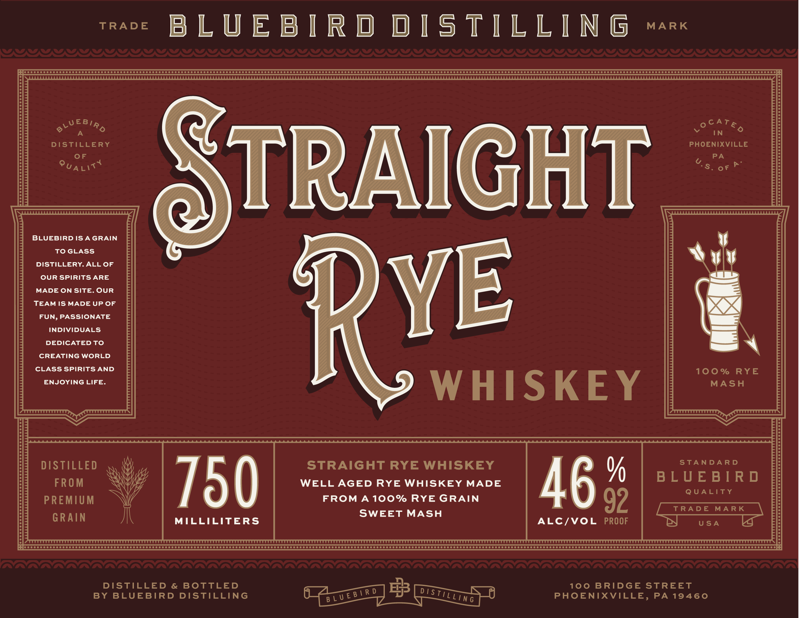
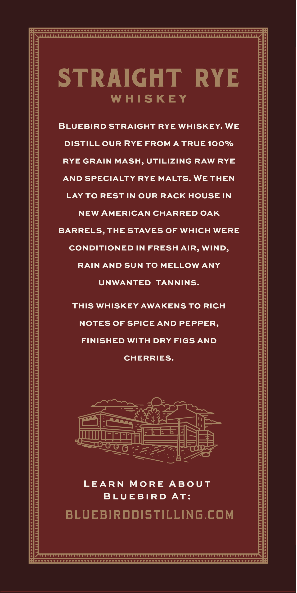
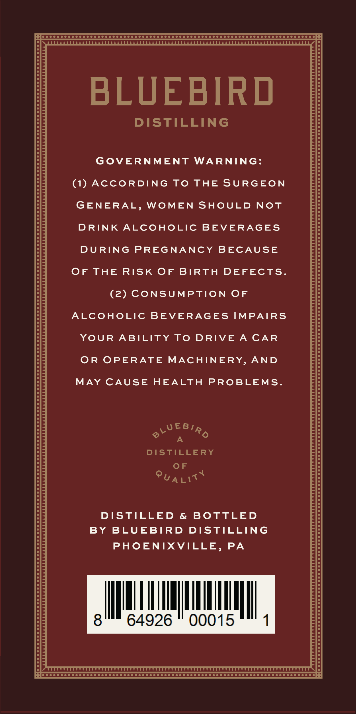

# TTB COLA Label Images - TTBID 26153001000763

**Brand Name:** BLUEBIRD DISTILLING

**Fanciful Name:** RYE WHISKEY

**Issue Date:** 06/05/2026

**Origin Code:** 39

**Product Class/Type:** 102

**Source:** [TTB Public COLA Registry](https://ttbonline.gov/colasonline/viewColaDetails.do?action=publicFormDisplay&ttbid=26153001000763)

## Label Images

### Label 1

### Label 2

### Label 3

## Extracted Label Text

*Text extracted via OCR - may contain errors*

### Label 1

TRADE

MARK

BLUEBIRD DISTILLING

0000

poo

oooon:;

VUEBin

eOeey

A

IN

DISTILLERY

PHOENIXVILLE

F

PA

(7

Pua

S.or®

TRAIGHT

BLUEBIRD ISA GRAIN

TOGLASS

DISTILLERY. ALL OF

OUR SPIRITS ARE

MADE ON SITE. OUR

TEAM IS MADE UP OF

FUN, PASSIONATE

INDIVIDUALS

DEDICATED TO

CREATING WORLD

YE 4

CLASS SPIRITS AND

100%

RYE

ENJOYING LIFE.

MASH

WHISKEY

STANDARD

DISTILLED

STRAIGHT RYE WHISKEY

BLUEBIRD

FROM

WELL AGED RYE WHISKEY MADE

QUALITY

PREMIUM

FROM A 100% RYE GRAIN

46

SWEET MASH

GRAIN

¥

ALC/VOL PROOF

USA

ooo

DISTILLED & BOTTLED

100 BRIDGE STREET

BY BLUEBIRD DISTILLING

PHOENIXVILLE, PA 19460

Arey a

### Label 2

So cc cc ccc cc ccc eee eo SO OOOO COSCO O OOOO SO DOO TOTO TOTO TODO OOOO OOOO DODO OO OS]

STRAIGHT RYE

WHISKEY

BLUEBIRD STRAIGHT RYE WHISKEY. WE

DISTILL OUR RYE FROM A TRUE 100%

RYE GRAIN MASH, UTILIZING RAW RYE

AND SPECIALTY RYE MALTS. WE THEN

LAY TO REST IN OUR RACK HOUSE IN

NEW AMERICAN CHARRED OAK

BARRELS, THE STAVES OF WHICH WERE

CONDITIONED IN FRESH AIR, WIND

RAIN AND SUN TO MELLOW ANY

UNWANTED TANNINS

THIS WHISKEY AWAKENS TO RICH

NOTES OF SPICE AND PEPPER,

FINISHED WITH DRY FIGS AND

CHERRIES.

OO on

—o

pane,

ae

FEE EH

=

J wee

=a

CS se

ic

Grew

= om

a eked ee

LEARN MORE ABOUT

BLUEBIRD AT:

BLUEBIRDDISTILLING.COM

Pe CCC OCOCC COO OCOO COC OCO OOOO OOOO OOOO OOO OOOOOSODOOOOTOD OOOO TODO OOO TODO OOO®

### Label 3

Poe O COCO CSO O OOOO OS CO OOOO STOO OOOO SOT OOOO TODO OO TOT OOOO DODO OOOO OOOO OOOO OS

BLUEBIRD

DISTILLING

GOVERNMENT WARNING:

(1) ACCORDING TO THE SURGEON

GENERAL, WOMEN SHOULD NOT

DRINK ALCOHOLIC BEVERAGES

DURING PREGNANCY BECAUSE

OF THE RISK OF BIRTH DEFECTS

(2) CONSUMPTION OF

ALCOHOLIC BEVERAGES IMPAIRS

YOUR ABILITY TO DRIVE A CAR

OR OPERATE MACHINERY, AND

MAY CAUSE HEALTH PROBLEMS.

2

WWEBIa

A

DISTILLERY

OF

Pua

DISTILLED & BOTTLED

BY BLUEBIRD DISTILLING

PHOENIXVILLE, PA

Wl,

WN

Jl

64926

00015

I

C QggooooooooooooooOOOOOOOOOOOOOOOOOOOOOOOOOOOOOOOOOOOOOOOOOOOOOOOOOOOOOOOoO
