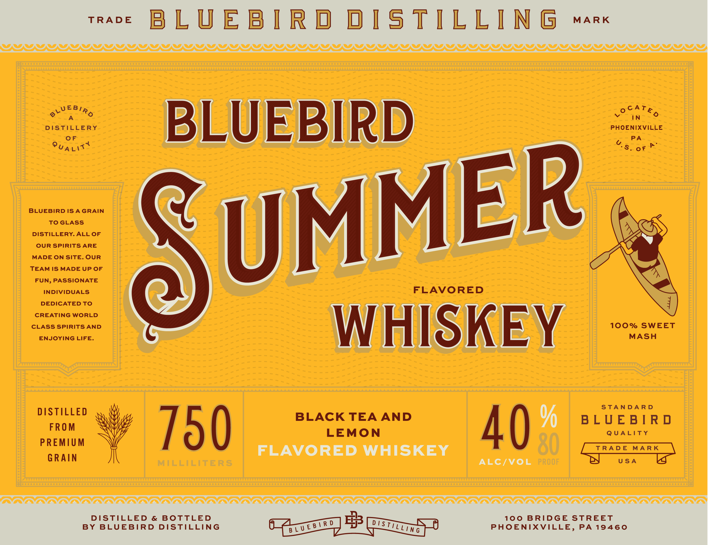
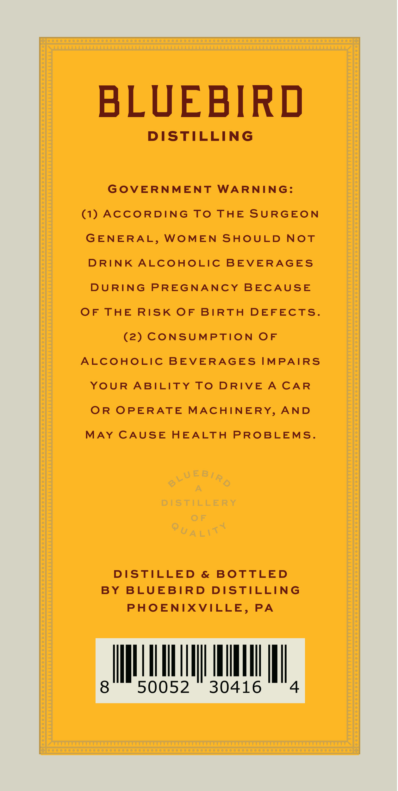
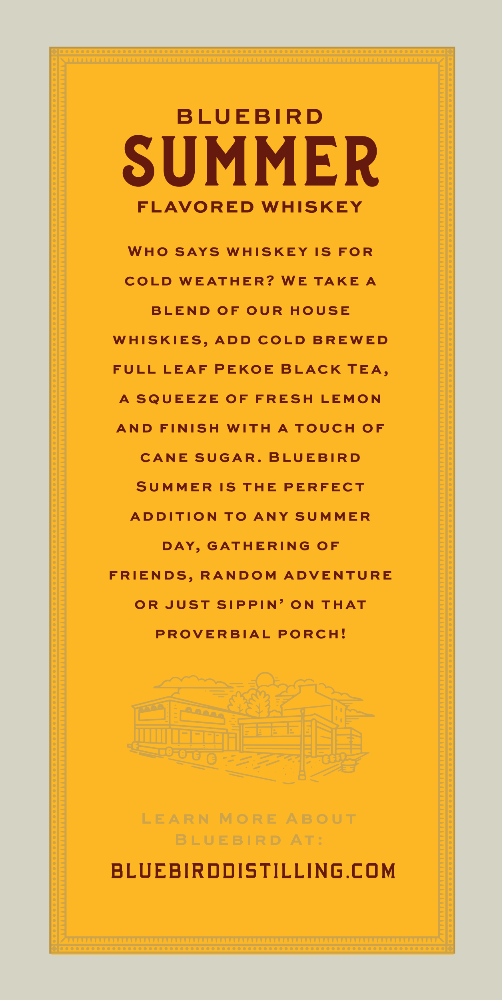

# TTB COLA Label Images - TTBID 26153001000794

**Brand Name:** BLUEBIRD DISTILLING

**Fanciful Name:** SUMMER

**Issue Date:** 06/11/2026

**Origin Code:** 39

**Product Class/Type:** 149

**Source:** [TTB Public COLA Registry](https://ttbonline.gov/colasonline/viewColaDetails.do?action=publicFormDisplay&ttbid=26153001000794)

## Label Images

### Label 1

### Label 2

### Label 3

## Extracted Label Text

*Text extracted via OCR - may contain errors*

### Label 1

BLUEBIRD OISTILLING

PDADIUTIUIDFIDFIUFLFJIUFJDPFJFJFJDFU[GFDF[FDFFDFJDFDUGFDFDFIDUFDFDGIGDGFDUGTDGUTGDTDTDTIDGDGIDTGDGDUTFDDUTGIGTGTGDUTDGUTIDGUIUDIDGIGDIDIITGDGIFIDFDS

WEBI AY

Vv

DeATE,

IN

DISTILLERY

PHOENIXVILLE

fe)

PA

co)

4

BLUEBIRD

&

oF

BLUEBIRD ISAGRAIN

TOGLASS

DISTILLERY. ALL OF

OUR SPIRITS ARE

MADE ON SITE. OUR

TEAM IS MADE UP OF

MME

FUN, PASSIONATE

INDIVIDUALS

FLAVORED

DEDICATED TO

CREATING WORLD

CLASS SPIRITS AND

100% SWEET

MASH

ENJOYING LIFE.

Qu

WHISKEY

STANDARD

DISTILLED

BLACK TEA AND

BLUEBIRD

FROM

LEMON

QUALITY

PREMIUM

At).

FLAVORED WHISKEY

GRAIN

% 750

ALC/VOL

wR

USA

me

OMA VO VV VOI VV VV OVO OVO VV VV OV OVO OVO VV VO VV VV VO VO OVO VO VV VV VV

### Label 2

BLUEBIRD

DISTILLING

GOVERNMENT WARNING:

(1) ACCORDING TO THE SURGEON

GENERAL, WOMEN SHOULD NOT

DRINK ALCOHOLIC BEVERAGES

DURING PREGNANCY BECAUSE

OF THE RISK OF BIRTH DEFECTS

(2) CONSUMPTION OF

ALCOHOLIC BEVERAGES IMPAIRS

YOUR ABILITY TO DRIVE A CAR

OR OPERATE MACHINERY, AND

MAY CAUSE HEALTH PROBLEMS

DISTILLED & BOTTLED

BY BLUEBIRD DISTILLING

PHOENIXVILLE, PA

AMM

50052 30416

### Label 3

BLUEBIRD
SUMMER
FLAVORED
WHISKEY
WhO
SAYS
WHISKEY
IS
FOR
COLD
WEATHER?
WE
TAKE
A_
BLEND
OF
OUR
HOUSE
WHISKIES,
ADD
COLD
BREWED
FULL
LEAF
PEKOE
BLACK TEA,
A
SQUEEZE
OF
FRESH
LEMON
AND
FINISH
WITH
AS
TOUCH
OF
CANE SUGAR.
BLUEBIRD
SUMMER
IS
TE
PERFECT
ADDITION
To
ANY
SUMMER
DAY,
GATAERING
OF
FRIENDS,
RANDOM
ADVENTURE
OR
JUst SipPIN'
ON
THAT
PROVERBIAL PORCH!
LEARN
MoRE
ABOUT
BLUEBIRD
AT :
BLUEBIRDDISTILLING.COM
