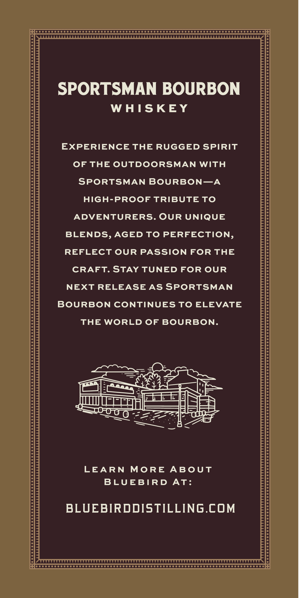

# TTB COLA Label Images - TTBID 26153001000820

**Brand Name:** BLUEBIRD DISTILLING

**Fanciful Name:** SPORTSMAN 'ART OF THE FLY'

**Issue Date:** 06/10/2026

**Origin Code:** 39

**Product Class/Type:** 101

**Source:** [TTB Public COLA Registry](https://ttbonline.gov/colasonline/viewColaDetails.do?action=publicFormDisplay&ttbid=26153001000820)

## Label Images

### Front Label

## Extracted Label Text

*Text extracted via OCR - may contain errors*

### Front Label

SPORTSMAN BOURBON

WHISKEY

EXPERIENCE THE RUGGED SPIRIT

OF THE OUTDOORSMAN WITH

SPORTSMAN BOURBON—A

HIGH-PROOF TRIBUTE TO

ADVENTURERS. OUR UNIQUE

BLENDS, AGED TO PERFECTION

REFLECT OUR PASSION FOR THE

CRAFT. STAY TUNED FOR OUR

NEXT RELEASE AS SPORTSMAN

BOURBON CONTINUES TO ELEVATE

THE WORLD OF BOURBON

COO on

——ae

S43

———————

ape

J mute

EE EE |

EEEELS

=a

aes

GEEE

SR

LEARN MORE ABOUT

BLUEBIRD AT:

BLUEBIRDDISTILLING.COM
