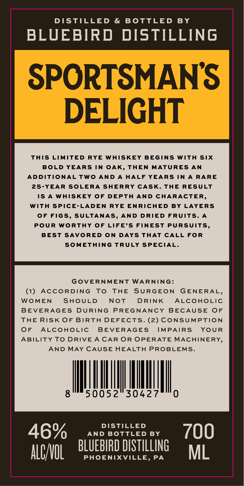
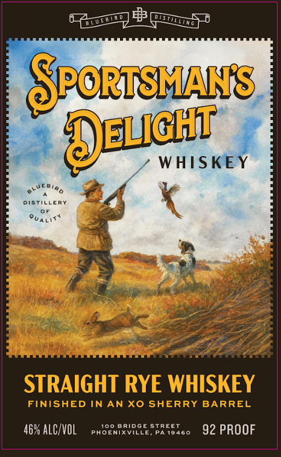

# TTB COLA Label Images - TTBID 26153001000833

**Brand Name:** BLUEBIRD DISTILLING

**Fanciful Name:** SPORTSMAN DELIGHT

**Issue Date:** 06/05/2026

**Origin Code:** 39

**Product Class/Type:** 102

**Source:** [TTB Public COLA Registry](https://ttbonline.gov/colasonline/viewColaDetails.do?action=publicFormDisplay&ttbid=26153001000833)

## Label Images

### Back Label

### Label 1

## Extracted Label Text

*Text extracted via OCR - may contain errors*

**Detected Proof:** 92

### Back Label

DISTILLED & BOTTLED BY

BLUEBIRD DISTILLING

SPORTSMANS

DELIGHT

THIS LIMITED RYE WHISKEY BEGINS WITH SIX

BOLD YEARS IN OAK, THEN MATURES AN

ADDITIONAL TWO AND A HALF YEARS IN A RARE

25-YEAR SOLERA SHERRY CASK. THE RESULT

IS A WHISKEY OF DEPTH AND CHARACTER

WITH SPICE-LADEN RYE ENRICHED BY LAYERS

OF FIGS, SULTANAS, AND DRIED FRUITS. A

POUR WORTHY OF LIFE’S FINEST PURSUITS,

BEST SAVORED ON DAYS THAT CALL FOR

SOMETHING TRULY SPECIAL.

GOVERNMENT WARNING:

(1) ACCORDING TO THE SURGEON GENERAL

WOMEN

SHOULD

NOT

DRINK

ALCOHOLIC

BEVERAGES DURING PREGNANCY BECAUSE OF

THE RISK OF BIRTH DEFECTS. (2) CONSUMPTION

OF ALCOHOLIC BEVERAGES

IMPAIRS YOUR

ABILITY TO DRIVE A CAR OR OPERATE MACHINERY

AND MAY CAUSE HEALTH PROBLEMS

AI AM,

|

50052 30427

DISTILLED

0

AND BOTTLED BY

LUEBIRD DISTILLING

rol

PHOENIXVILLE, PA

ML

### Label 1

GPoRISMANS
O@udit
WHISKEY
ERY
STRAIGHT RYE WHISKEY
FINISHED IN AN Xo SHERRY BARREL
46% ALC/VOL
PhooNbRVBGE_
SpREsg6o
92 PROOF
DQDO
