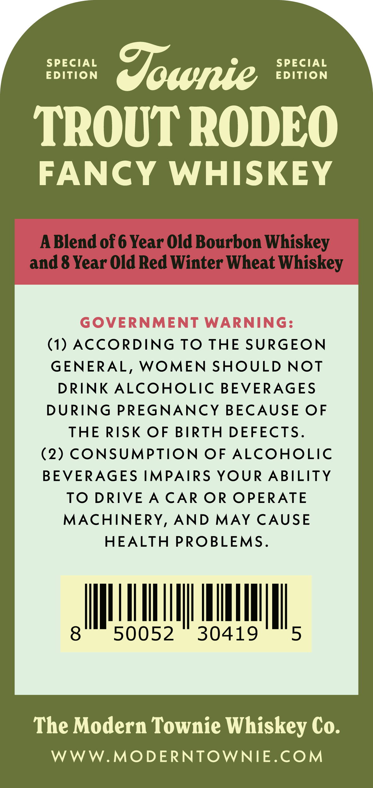
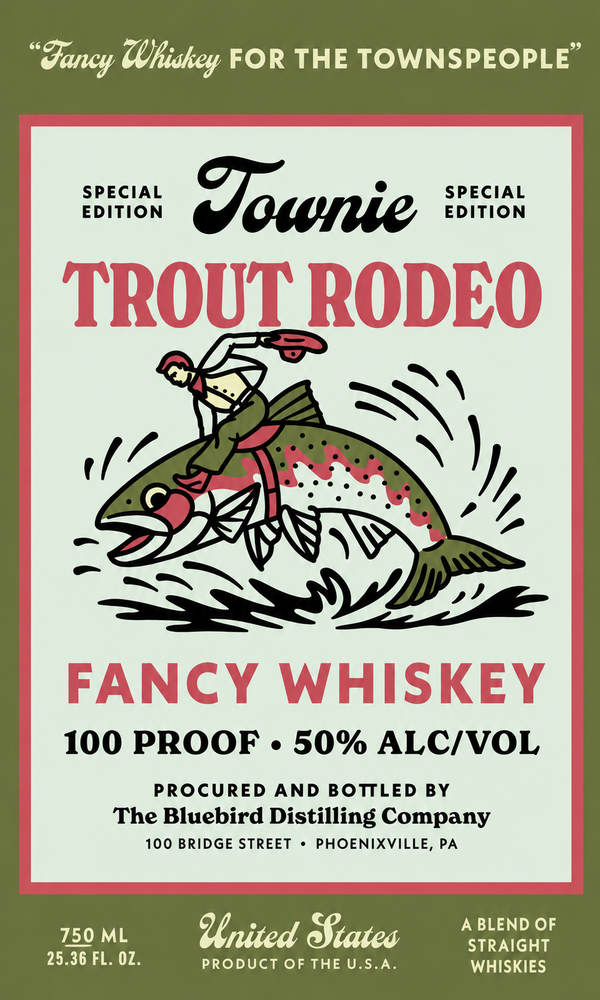

# TTB COLA Label Images - TTBID 26153001000841

**Brand Name:** TOWNIE

**Fanciful Name:** TROUT RODEO

**Issue Date:** 06/18/2026

**Origin Code:** 39

**Product Class/Type:** 129

**Source:** [TTB Public COLA Registry](https://ttbonline.gov/colasonline/viewColaDetails.do?action=publicFormDisplay&ttbid=26153001000841)

## Label Images

### Back Label

### Front Label

## Extracted Label Text

*Text extracted via OCR - may contain errors*

**Detected Proof:** 100
**Detected Age:** 6 Years

### Back Label

SPECIAL

SPECIAL

EDITION

Sownie

EDITION

TROUT RODEO

FANCY WHISKEY

ABlend of 6 Year Old Bourbon Whiskey

and 8 Year Old Red Winter Wheat Whiskey

(1) ACCORDING TO THE SURGEON

GENERAL, WOMEN SHOULD NOT

DRINK ALCOHOLIC BEVERAGES

DURING PREGNANCY BECAUSE OF

THE RISK OF BIRTH DEFECTS

(2) CONSUMPTION OF ALCOHOLIC

BEVERAGES IMPAIRS YOUR ABILITY

TO DRIVE A CAR OR OPERATE

MACHINERY, AND MAY CAUSE

HEALTH PROBLEMS

A

50052 30419

The Modern Townie Whiskey Co.

WWW.MODERNTOWNIE.COM

### Front Label

"gancy (Ukiskey FOR THE TOWNSPEOPLE'
EdECON
Jownie
{deCON
TROUC RODEO
FANCY
WHISKEY
100 PROOF
50% ALC/VOL
PROCURED
AND BOTTLED BY
The Bluebird Distilling Company
100 BRIdGE STREET
PHOENIXVILLE, PA
750 ML
United Biateo
A BLEND OF
STRAiGHT
25.36 FL. 0Z.
PRODUCT OF THE U.S.A_
WHISKIES
