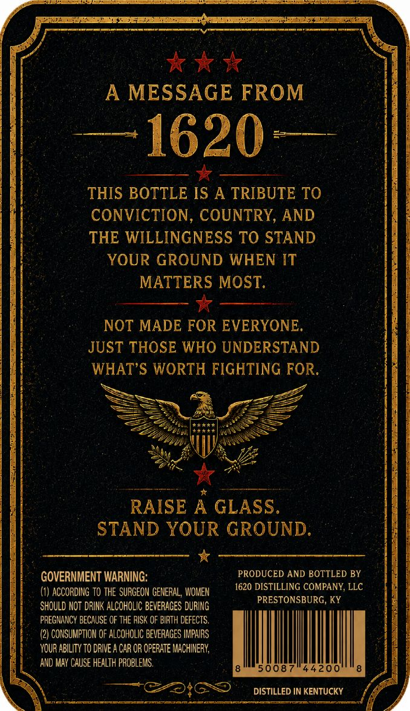
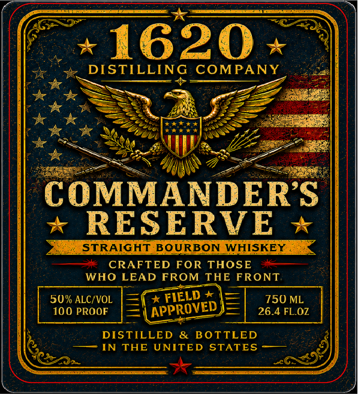
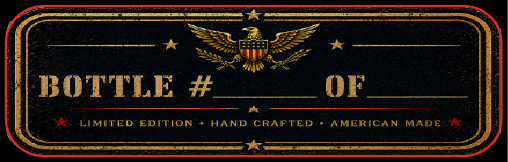

# TTB COLA Label Images - TTBID 26153001000939

**Brand Name:** 1620 DISTILLING COMPANY

**Fanciful Name:** COMMANDER'S RESERVE

**Issue Date:** 06/09/2026

**Origin Code:** 22

**Product Class/Type:** 101

**Source:** [TTB Public COLA Registry](https://ttbonline.gov/colasonline/viewColaDetails.do?action=publicFormDisplay&ttbid=26153001000939)

## Label Images

### Back Label

### Front Label

### Label 2

## Extracted Label Text

*Text extracted via OCR - may contain errors*

**Detected Proof:** 100

### Back Label

A MESSAGE FROM
1620
THIS BOTTLE IS A TRIBUTE TO
CONVICTION, COUNTRY, AND
THE WILLINGNESS TO STAND
YOUR GROUND WHEN IT
MATTERS MOST:
NOT MADE FOR EVERYONE.
JUST THOSE WHO UNDERSTAND
WHAT'S WORTH FIGHTING FOR.
RAISE
A GLASS.
STAND YOUR GROUND.
GOVERNMENT WARNING:
PRODUCED AND BOTTLED BY
(1) ACCORDING TO THE SURGEON GENERAL , WOMEN
1620 DISTILLING COMPANY; LLC
PRESTONSBURG, KY
SHOULD NOT DRINK ALCOHOLIC BEvERAGES DURING
PREGNANCY BECAUSE OF THE RISK OF BIRTH DEFECTS.
CONSUMPTION oF ALCOHOLIC BEVERAGES IMPARS
YOUR ABILITY TO DRIVE A CAR OR OPERATE MACHINERY;
AND MAY CAUSE HEALTh PROBLEMS.
008
DISTILLED IN KENTUCKY

### Front Label

1620
DISTILLING
COMPANY
COMMANDERS
RESERVE
STRAIGHT BoURBON WHISKEY
7e
CRAFTED FOR THOSE
WHO LEAD FROM
THE FRONT
5uw ALC  VOL
* FIELD
750 ML
100 PROOF
26.4 FLOZ
DISTILLED
& BOTTLED
IN THE UNITED STATES
APPROVED

### Label 2

BOTTLE #
0F
LIMITED
EDITION
AAND
CRAFTED
AMeRICAN
MADE
