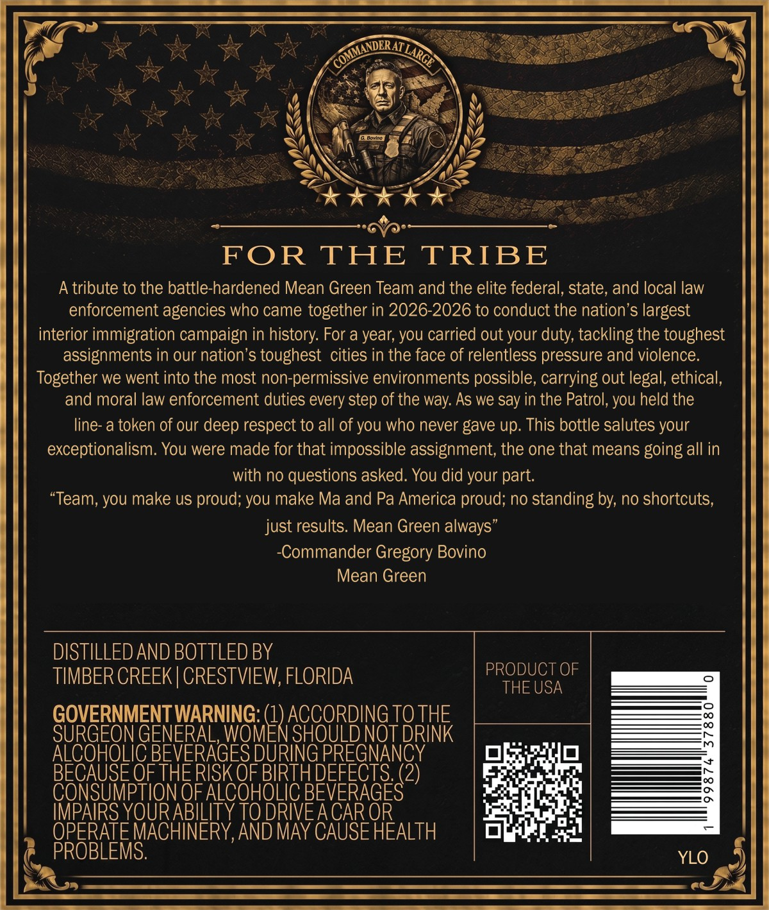
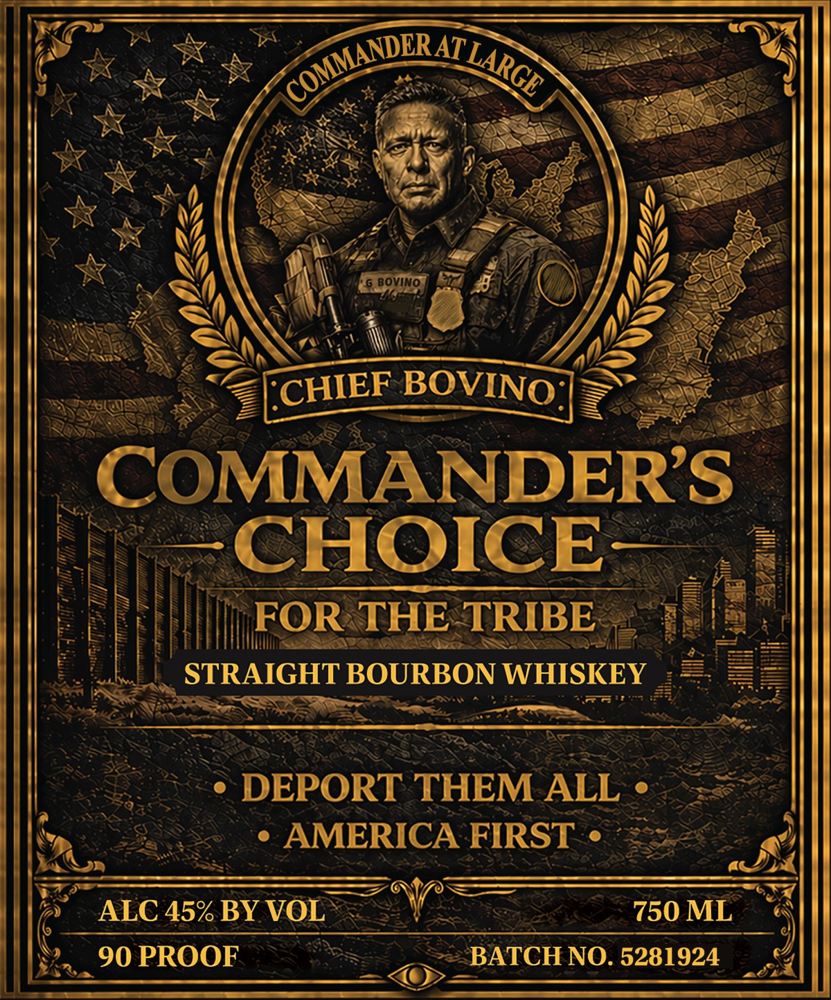

# TTB COLA Label Images - TTBID 26154001000041

**Brand Name:** COMMANDER'S CHOICE

**Issue Date:** 07/14/2026

**Origin Code:** 16

**Product Class/Type:** 101

**Source:** [TTB Public COLA Registry](https://ttbonline.gov/colasonline/viewColaDetails.do?action=publicFormDisplay&ttbid=26154001000041)

## Label Images

### Back Label

### Front Label

## Extracted Label Text

*Text extracted via OCR - may contain errors*

**Detected Proof:** 90

### Back Label

AT
Noitim
FOR
THE
TRIBE
A tribute to the battle-hardened Mean Green Team and the elite federal, state, and local law
enforcement agencies who came together in 2026-2026 to conduct the nation's largest
interior immigration campaign in history: For a year; you carried out your duty; tackling the toughest
assignments in our nation's toughest cities in the face of relentless pressure and violence.
Together we went into the most non-permissive environments possible, carrying out legal, ethical,
and moral law enforcement duties every step of the way: As we say in the Patrol, you held the
line- a token of our deep respect to all of you who never gave up: This bottle salutes your
exceptionalism. You were made for that impossible assignment; the one that means going all in
with no questions asked: You did your part.
"Team, you make uS proud; you make Ma and Pa America proud; no standing by; no shortcuts;
just results. Mean Green always"
Commander Gregory Bovino
Mean Green
DISTILLED AND BOTTLED BY
TIMBER CREEK | CRESTVIEW; FLORIDA
PRODUCT OF
THE USA
GOVERNMENT WARNING:
ACCORDING TO THE
SURGEON GENERAL, WOMEN SHOULD NOT DRINK
ALCOHOLIC BEVERAGES DURING PREGNANCY
BECAUSE OF THERISK OF BIRTHDEFECTS
BBVEFAGES2)
CONSUMPTION OF ALCOHOLIC
IMPAIRS YOUR ABILITY TO DRIVEA CAR OR
OPERATE MACHINERY,AND MAY CAUSE HEALTH
PROBLEMS:
YLO
COMMANDER ,
LARGE

### Front Label

BOVINO
BOVIN
COMMANDERS
CHOICE
FOR THE TRIBE
STRAIGHT BOURBON WHISKEY
DEPORT THEM ALL
AMERICA FIRST
ALC 45% BY VOL
750 ML
90 PROOF
BATCH NO. 5281924
COMMANDERAT /
LARGE
CHIEF
