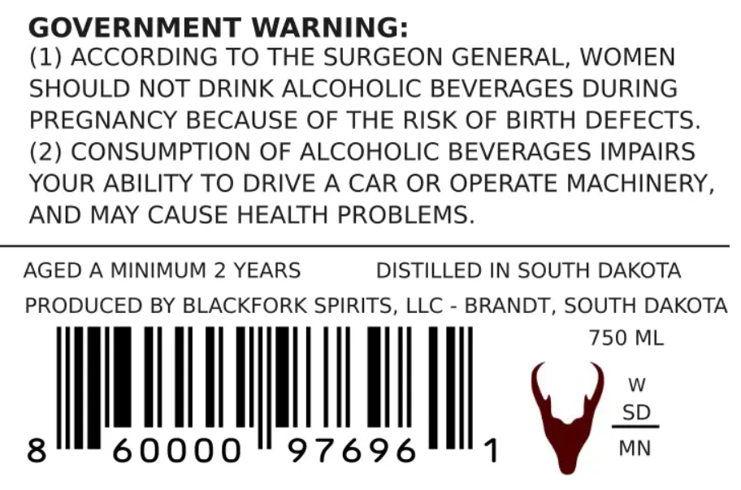
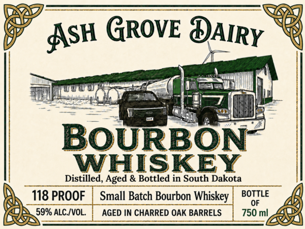

# TTB COLA Label Images - TTBID 26154001000113

**Brand Name:** ASH GROVE DAIRY

**Issue Date:** 06/08/2026

**Origin Code:** 42

**Product Class/Type:** 141

**Source:** [TTB Public COLA Registry](https://ttbonline.gov/colasonline/viewColaDetails.do?action=publicFormDisplay&ttbid=26154001000113)

## Label Images

### Back Label

### Label 1

## Extracted Label Text

*Text extracted via OCR - may contain errors*

**Detected Proof:** 118
**Detected Age:** 2 Years

### Back Label

GOVERNMENT WARNING:
(1) ACCORDING TO THE SURGEON GENERAL, WOMEN
SHOULD NOT DRINK ALCOHOLIC BEVERAGES DURING
PREGNANCY BECAUSE OF THE RISK OF BIRTH DEFECTS.
(2) CONSUMPTION OF ALCOHOLIC BEVERAGES IMPAIRS
YOUR ABILITY TO DRIVE A CAR OR OPERATE MACHINERY
AND MAY CAUSE HEALTH PROBLEMS.
AGED A MINIMUM 2 YEARS
DISTILLED IN SOUTH DAKOTA
PRODUCED BY BLACKFORK SPIRITS, LLC
BRANDT, SOUTH DAKOTA
750 ML
W
SD
8
60000
97696
MN

### Label 1

ASH GROVE DAIRY
BOURBON
WHISKEY
Distilled, Aged & Bottled in South Dakota
118 PROOF
Small Batch Bourbon Whiskey
BOTTLE
OF
59% ALC /VOL
AGED IN CHARRED OAK BARRELS
750 ml
