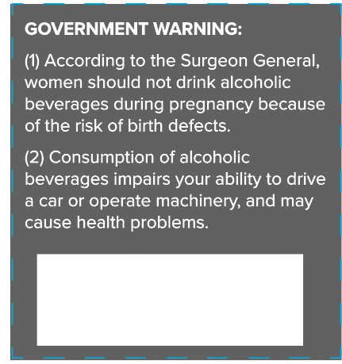
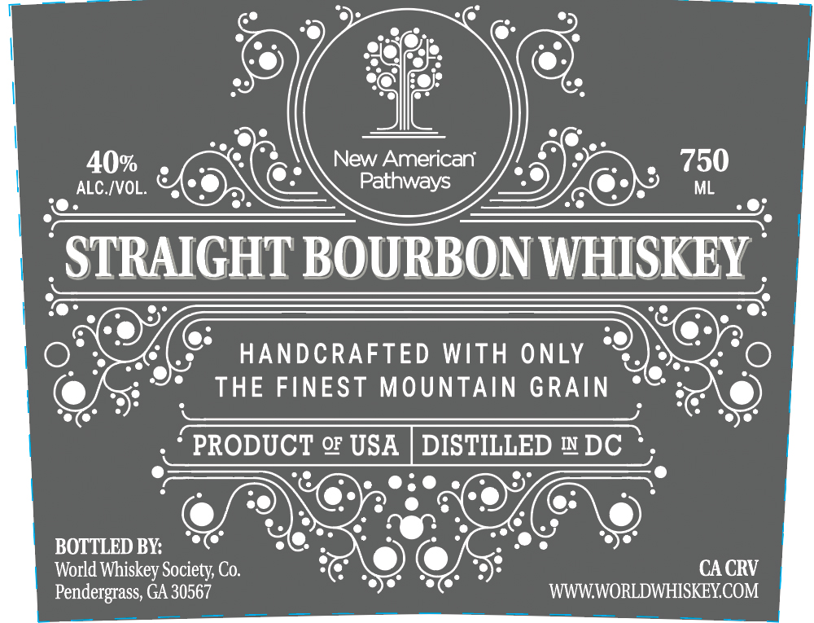

# TTB COLA Label Images - TTBID 26154001000232

**Brand Name:** NEW AMERICAN PATHWAYS

**Issue Date:** 06/08/2026

**Origin Code:** 08

**Product Class/Type:** 101

**Source:** [TTB Public COLA Registry](https://ttbonline.gov/colasonline/viewColaDetails.do?action=publicFormDisplay&ttbid=26154001000232)

## Label Images

### Back Label

### Front Label

## Extracted Label Text

*Text extracted via OCR - may contain errors*

**Detected Proof:** 80

### Back Label

GOVERNMENT WARNING:

(1) According to the Surgeon General,

women should not drink alcoholic

beverages during pregnancy because

of the risk of birth defects.

(2) Consumption of alcoholic

beverages impairs your ability to drive

@ car or operate machinery, and may

cause health problems.

### Front Label

40%
New American
750
ALC /VOL.
Pathways
ML
STRAIGHT BOURBON WHISKEY
HANDCRAFTED WIth ONLY
THE FINEST
MOUNTAIN GRAIN
PRODUCT Q USA
DISTILLED
IN
DC
BOTTLED BY:
World Whiskey Society Co:
CA CRV
Pendergrass; GA 30567
WWWWORLDWHISKEYCOM
