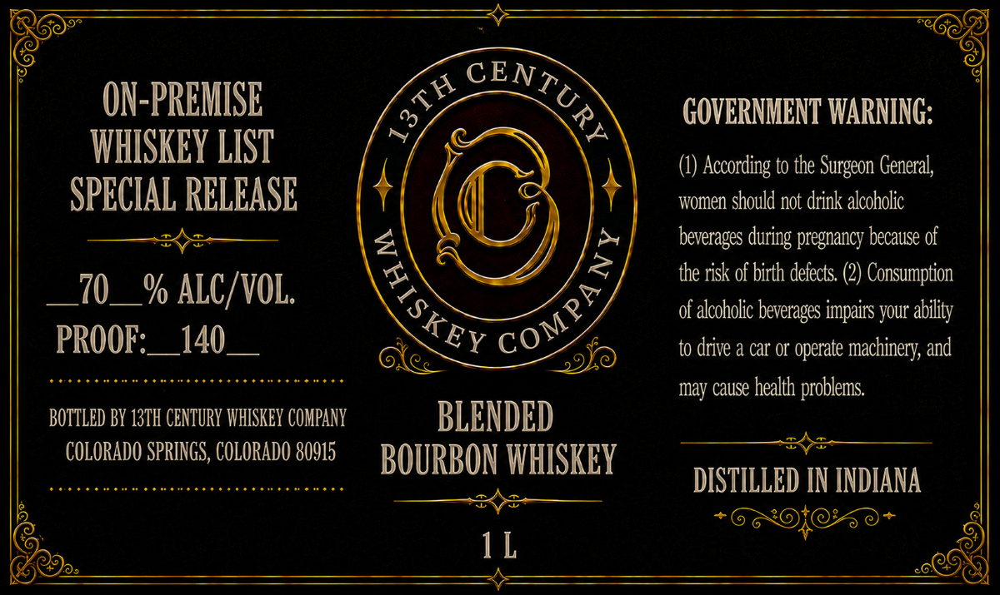

# TTB COLA Label Images - TTBID 26154001000267

**Brand Name:** 13TH CENTURY WHISKEY COMPANY

**Issue Date:** 06/16/2026

**Origin Code:** 13

**Product Class/Type:** 131

**Source:** [TTB Public COLA Registry](https://ttbonline.gov/colasonline/viewColaDetails.do?action=publicFormDisplay&ttbid=26154001000267)

## Label Images

### Back Label

## Extracted Label Text

*Text extracted via OCR - may contain errors*

**Detected Proof:** 140

### Back Label

ON-PREMISE
GOVERNMENT WARNING:
WHISKEY LIST
According to the
General;
SPECIAL RELEASE
women should not drink alcoholic
beverages during pregnancy because of
the risk of birth defects: (2) Consumption
70
% ALC/VOL.
of alcoholic beverages inpairs your ability
PROOF:
140
to drive & car Or
operate machinery, and
may cause health problems
BOTTLED BY 13TH CENTURY WHISKEY COMPANY
BLENDED
COLORADO SPRINGS, COLORADO 80915
BOURBON WHISKEY
DISTILLED IN INDIANA
1L
CENTURY
5
Surgeon '
)
{
