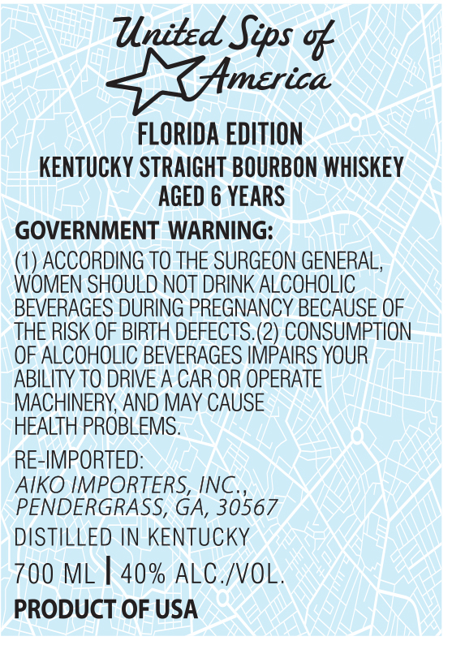

# TTB COLA Label Images - TTBID 26154001000284

**Brand Name:** UNITED SIPS OF AMERICA

**Fanciful Name:** FLORIDA EDITION

**Issue Date:** 06/09/2026

**Origin Code:** 00

**Product Class/Type:** 101

**Source:** [TTB Public COLA Registry](https://ttbonline.gov/colasonline/viewColaDetails.do?action=publicFormDisplay&ttbid=26154001000284)

## Label Images

### Front Label

## Extracted Label Text

*Text extracted via OCR - may contain errors*

**Detected Proof:** 80
**Detected Age:** 6 Years

### Front Label

United Sips %
Hmerica
FLORIDA EDITION
KENTUCKY STRAIGHT BOURBON WHISKEY
AGED 6 YEARS
GOVERNMENT WARNING:
(1) ACCORDING TO THE SURGEON GENERAL,
WOMEN SHOULD NOT DRINK ALCOHOLIC
BEVERAGES DURING PREGNANCY BECAUSE OF
THE RISK OF BIRTH DEFECTS (2) CONSUMPTION
OF ALCOHOLIC BEVERAGES IMPAIRS YOUR
ABILITY TO DRIVE A CAR OR OPERATE
MACHINERY AND MAY CAUSE
HEALTH PROBLEMS.
RE-IMPORTED:
AIKO IMPORTERS, INC.
PENDERGRASS, GA, 30567
DISTILLED IN KENTUCKY
700 ML
40% ALC /VOL.
PRODUCT OF USA
