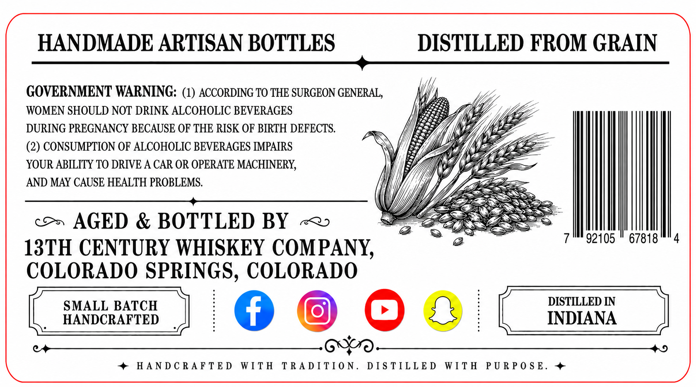

# TTB COLA Label Images - TTBID 26154001000309

**Brand Name:** 13TH CENTURY WHISKEY COMPANY

**Issue Date:** 06/16/2026

**Origin Code:** 13

**Product Class/Type:** 131

**Source:** [TTB Public COLA Registry](https://ttbonline.gov/colasonline/viewColaDetails.do?action=publicFormDisplay&ttbid=26154001000309)

## Label Images

### Back Label

## Extracted Label Text

*Text extracted via OCR - may contain errors*

### Back Label

HANDMADE ARTISAN BOTTLES
DISTILLED FROM GRAIN
GOVERNMENT WARNING: (1) ACCORDING TO THE SURGEON GENERAL,
WOMEN SHOULD NOT DRINK ALCOHOLIC BEVERAGES
DURING PREGNANCY BECAUSE OF THE RISK OF BIRTH DEFECTS.
(2) CONSUMPTION OF ALCOHOLIC BEVERAGES IMPAIRS
YOUR ABILITY TO DRIVE A CAR OR OPERATE MACHINERY
AND MAY CAUSE HEALTH PROBLEMS
AGED & BOTTLED BY
92105
67818
13TH CENTURY WHISKEY COMPANY,
COLORADO SPRINGS, COLORADO
SMALL BATCH
DISTILLED IN
HANDCRAFTED
INDIANA
HA N D C RA F TE D
WITH
T RA DI TI 0 N.
D I S TIL L E D
WIT H
P U R P 0 S E.
