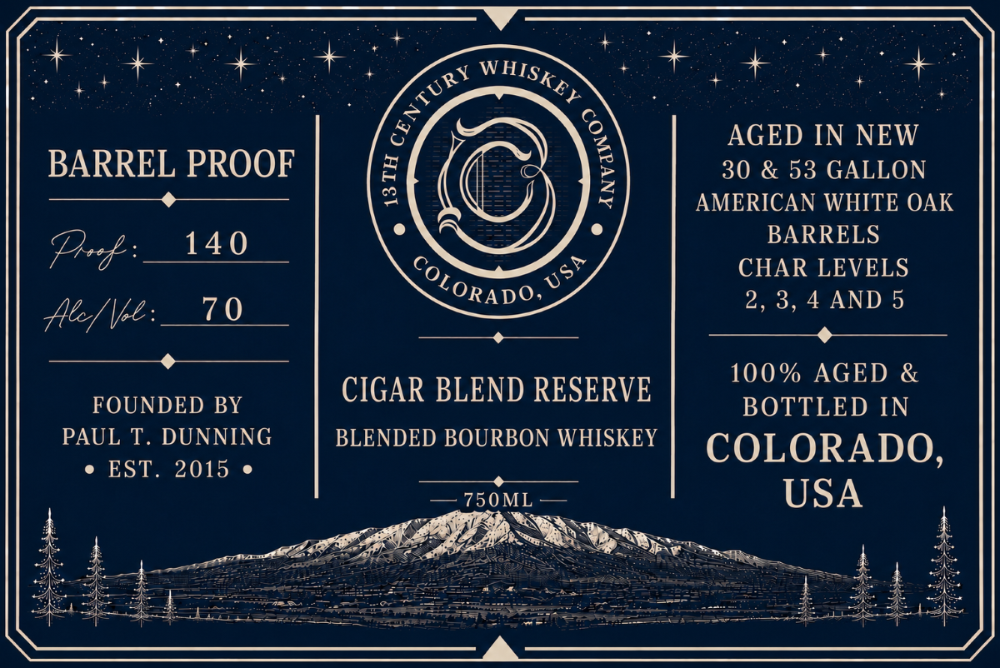

# TTB COLA Label Images - TTBID 26154001000348

**Brand Name:** 13TH CENTURY WHISKEY COMPANY

**Issue Date:** 06/22/2026

**Origin Code:** 13

**Product Class/Type:** 131

**Source:** [TTB Public COLA Registry](https://ttbonline.gov/colasonline/viewColaDetails.do?action=publicFormDisplay&ttbid=26154001000348)

## Label Images

### Back Label

## Extracted Label Text

*Text extracted via OCR - may contain errors*

**Detected Proof:** 60

### Back Label

be ee

t+

ay

gt w AIsy. ey,

AGED IN NEW

BARREL PROOF

30 & 53 GALLON

G

AMERICAN WHITE OAK

ot4O

BARRELS

Peg:

CHAR LEVELS

CcORADO

Ky

2, 3,4 AND 5

Ale// |b

——

100% AGED &

FOUNDED BY

CIGAR BLEND RESERVE

BOTTLED IN

PAUL T. DUNNING

BLENDED BOURBON WHISKEY

COLORADO

e EST. 2015 e

=O OML > —

USA

NY:

Op

sy

ne

eRe.

—~

=f —

owe Se co eee

Toe eee

anes

oe Fa eee Sseecitems en aren ee
