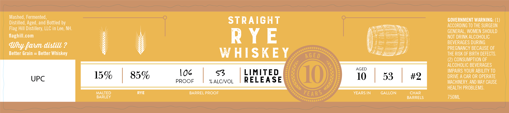

# TTB COLA Label Images - TTBID 26154001000394

**Brand Name:** FLAG HILL

**Issue Date:** 06/08/2026

**Origin Code:** 33

**Product Class/Type:** 102

**Source:** [TTB Public COLA Registry](https://ttbonline.gov/colasonline/viewColaDetails.do?action=publicFormDisplay&ttbid=26154001000394)

## Label Images

### Label 1

## Extracted Label Text

*Text extracted via OCR - may contain errors*

**Detected Proof:** 85

### Label 1

Mashed, Fermented,
Distilled; Aged, and Bottled by
STRAIGHT
GOVERNMENT WARNING: (1)
ACCORDING TO THE SURGEON
Hill
Distillery; LLC in Lee, NH;
GENERAL, WOMEN SHOULD
ilaghill.com
R Y E
NOT DRINK ALCOHOLIC
Why Qanm distilb ?
BEVERAGES DURING
PREGNANCY BECAUSE OF
Better Grain = Better Whiskey
W HISKE Y
AGE D
THE RISK OF BIRTH DEFECTS:
(2) CONSUMPTION OF
ALCOHOLIC BEVERAGES
AGED
15%
85%
Io6
LIMITED
10
10
53
#2
DRPAERS COUDRBIPERATQ
UPC
PROOF
% ALCIOL
RELEASE
MACHINERY, AND May CAUSE
HEALTH PROBLEMS,
MALTED
RYE
BARREL PROOF
YEARS
YEARS IN
GALLON
CHAR
BARLEY
BARRELS
750ML
Flag "
