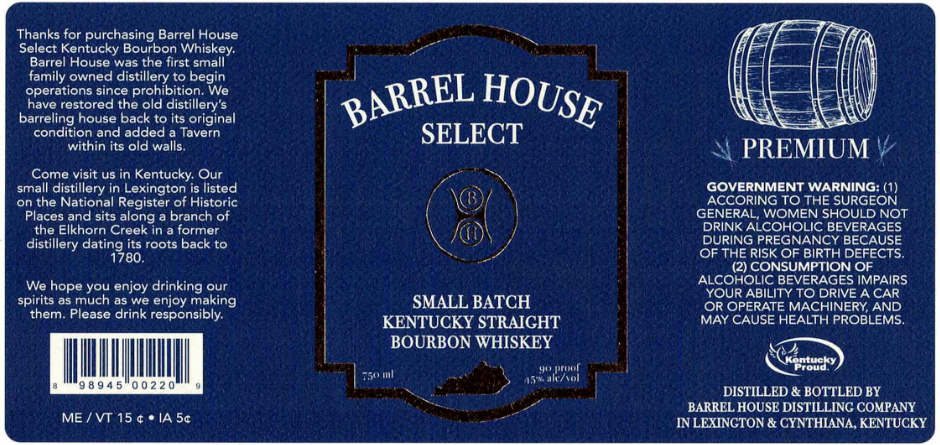

# TTB COLA Label Images - TTBID 26154001000460

**Brand Name:** BARREL HOUSE SELECT

**Fanciful Name:** SMALL BATCH

**Issue Date:** 06/11/2026

**Origin Code:** 22

**Product Class/Type:** 101

**Source:** [TTB Public COLA Registry](https://ttbonline.gov/colasonline/viewColaDetails.do?action=publicFormDisplay&ttbid=26154001000460)

## Label Images

### Label 1

## Extracted Label Text

*Text extracted via OCR - may contain errors*

### Label 1

Thanks for purchasing Barrel House
Select Kentucky Bourbon Whiskey:
Barrel House was the first small
family owned
d proibiiione
to begin
operations since
We
have restored the
distillery'$
barreling house back to its original
condition and added
Taavern
SELECT
within its old walls
PREMIUM
Come visit us5 in Kentucky: Our
small distillery in Lexington is listed
GOVERNMENT WARNING: (1)
on the National Register of Historic
ACCORING TO THE SURGEON
Places and sits along
branch of
GENERAL; WOMEN SHOULD NOT
the Elkhorn Creek in
former
DRINK ALCOHOLIC BEVERAGES
distillery
its roots back to
DURING PREGNANCY
'DEFECSS
dating80.
OF THE RISK OF BIRTH
(2) CONSUMPTION OF
We hope you enjoy drinking our
ALCOHOLIC BEVERAGES IMPAIRS
YOUR ABILITY TO DRIVE A CAR
spirits as much as we enjoy making
SMALL BATCH
OR OPERATE MACHINERY; AND
them. Please drink responsibly:
KENTUCKY STRAICHT
MAY CAUSE HEALTH PROBLEMS:
BOURBON WHISKEY
Hoctatt
Koroudky
75um
J5takttol
9 8 9 4 5
0 0 2 2 0
DISTILLED & BOTTLED BY
BARREL HOUSE DISTILLING COMPANY
ME /VT 15 4 * IA S4
INLEXINGTON & CYNTHLANA, KENTUCKY
BARREL
HOUSE
old
