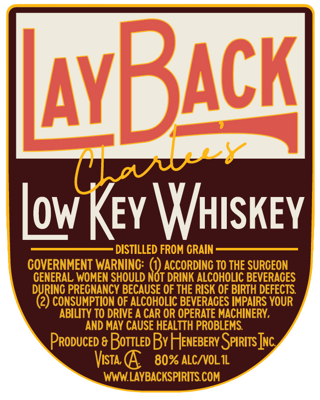
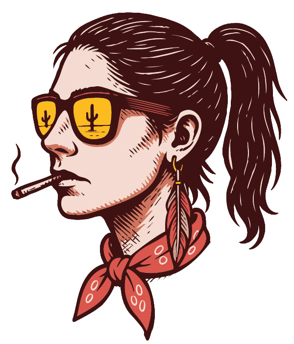

# TTB COLA Label Images - TTBID 26154001000480

**Brand Name:** LAYBACK

**Fanciful Name:** CHARLEE'S LOW KEY WHISKEY

**Issue Date:** 06/08/2026

**Origin Code:** 01

**Product Class/Type:** 140

**Source:** [TTB Public COLA Registry](https://ttbonline.gov/colasonline/viewColaDetails.do?action=publicFormDisplay&ttbid=26154001000480)

## Label Images

### Back Label

### Front Label

## Extracted Label Text

*Text extracted via OCR - may contain errors*

*1 image(s) excluded: text did not meet readability threshold*

**Detected Proof:** 80

### Back Label

ABach
low Kev WHISKEY
DISTILLED FROM CRAIN -
COVERNMENT WARNINC:
ACCORDINC TO THE SURCEON
CENERAL WOMEN SHOULD NOT DRINK ALCOHOLIC BEVERACES
DURINC PRECNANCY BECAUSE OF THE RISK OF BIRTH DEFECTS
2) CONSUMPTION OF ALCOHOLIC BEVERACES IMPAIRS YOUR
ABILITY TO DRIVE A CAR OR OPERATE MACHINERY ,
AND MAY CAUSE HEALTTH PROBLEMS
Produced & BottLed Bv H JeNEBeRv SelritsJnc
Vista
80% ALCNVOLIL
WWWLAYBACKSPIRITS COM
HDLl
