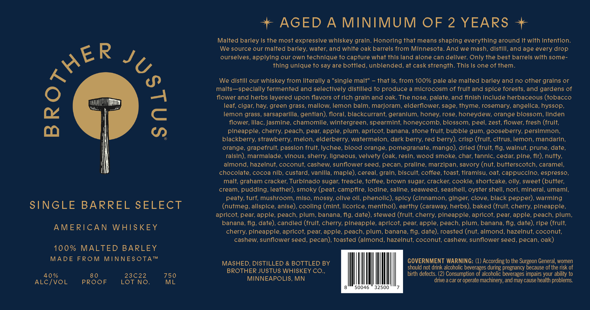

# TTB COLA Label Images - TTBID 26154001000485

**Brand Name:** BROTHER JUSTUS

**Issue Date:** 07/01/2026

**Origin Code:** 27

**Product Class/Type:** 140

**Source:** [TTB Public COLA Registry](https://ttbonline.gov/colasonline/viewColaDetails.do?action=publicFormDisplay&ttbid=26154001000485)

## Label Images

### Label 1

## Extracted Label Text

*Text extracted via OCR - may contain errors*

**Detected Proof:** 80
**Detected Age:** 2 Years

### Label 1

AGED
A
MINIMUM OF 2 YEARS
Malted barley Is the most expressive whlskey graln: Honoring that means shaplng everything around It Wlth Intentlon:
We source our malted barley; water; and whlte oak barrels from MInnesota. And We mash, dIstlll, and age every drop
ourselves, applyilng our own technlque to capture what thls land alone can dellver: Only the best barrels Wlth some-
thlng unlque to say are bottled, unblended, at cask strength. Thls Is one of them.
We distill our whiskey from literally a "single malt"
that Is, from 100% pale ale malted barley and no other grains or
malts--specially fermented and selectively distilled to produce a microcosm of fruit and spice forests, and gardens f
flower and herbs layered upon flavors of rich grain and oak The nose, palate, and finish Include herbaceous (tobacco
leaf, cigar; hay, green grass, mallow; lemon balm; marjoram, elderflower; sage, thyme, rosemary, angelica, hyssop
T
Iemon grass, sarsaparilla, gentian); floral, blackcurrant; geranium; honey; rose, honeydew; orange blossom; Iinden
flower; Iilac, Jasmine, chamomile, wintergreen; spearmint; honeycomb; blossom; peel, zest; flower; fresh (fruit;
pineapple, cherry; peach; pear; apple; plum; apricot; banana, stone fruit; bubble gum; gooseberry; persimmon;
blackberry; strawberry melon, elderberry; watermelon, dark berry; red berry), crisp (fruit, citrus, lemon; mandarin;
orange, grapefrult; passion frult; lychee, blood orange, pomegranate; mango); dried (frult; fig; walnut; prune, date
raisin); marmalade, vinous, sherry; ligneous; velvety (oak, resin; wood smoke, char; tannic, cedar; pine; fir); nutty,
almond, hazelnut; coconut, cashew; sunflower seed, pecan; praline, marzipan; savory (nut, butterscotch, caramel
chocolate, cocoa nib, custard, vanilla, maple); cereal, grain; biscult; coffee, toast, tiramisu; oat; cappuccino, espresso;
malt, graham cracker; Turbinado sugar; treacle, toffee, brown sugar; cracker; cookie, shortcake, olly, sweet (butter;
cream, pudding, leather), smoky (peat; campfire, lodine; saline, seaweed, seashell; oyster shell, nori, mineral, umami;
peaty, turf; mushroom; miso, mossy; ollve oll, phenolic) spicy (cinnamon; ginger; clove, black pepper), warming
SINGLE BARREL SELECT
(nutmeg, allspice, anise)  cooling (mint; licorice, menthol), earthy (caraway; herbs) baked (frult; cherry, pineapple;
apricot; pear; apple, peach; plum; banana; fig; date); stewed (frult; cherry; pineapple, apricot; pear; apple, peach; plum;
banana, fig; date); candied (fruit; cherry; pineapple, apricot; pear; apple; peach; plum; banana, fig, date)  ripe (fruit;
AMERICAN
WHIS KEY
cherry; pineapple, apricot; pear; apple, peach; plum; banana, fig, date), roasted (nut, almond, hazelnut; coconut;
cashew; sunflower seed, pecan); toasted (almond, hazelnut; coconut; cashew; sunflower seed, pecan; oak)
100%
MALTED BARLEY
MADE
FROM
MINNES OTA
TM
MASHED, DISTILLED & BOTTLED BY
GOVERNMENT WARNING: (1) According to the Surgeon General, women
should not drink alcoholic beverages during pregnancy because of the risk of
40 %
8 0
23C22
750
BROTHER JUSTUS WHISKEY CO.
birth defects. (2) Consumption of alcoholic beverages impairs your ability to
ALC/VOL
PROOF
Lot No_
ML
MINNEAPOLIS, MN
drive a car or operate machinery, and may cause health problems
50046
32500
0
3
