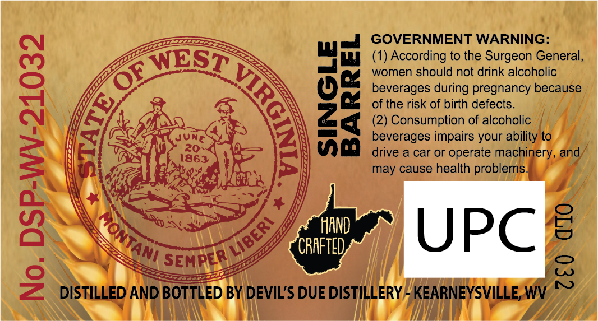
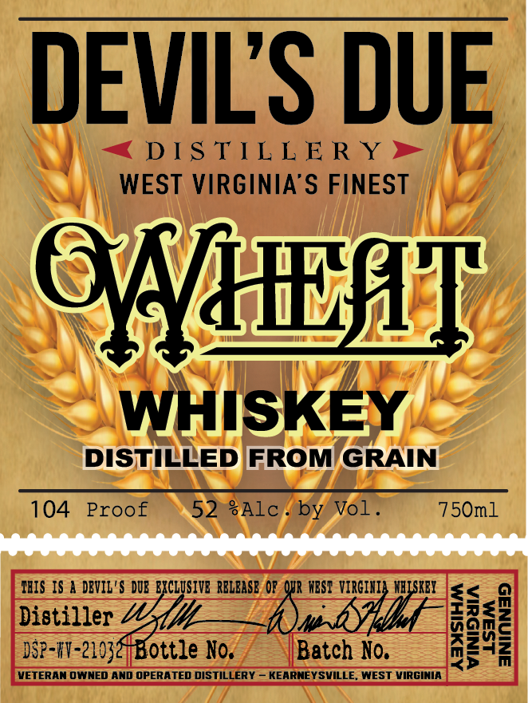
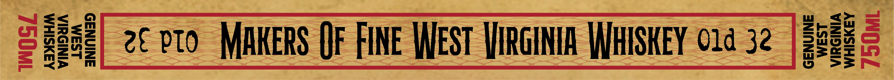

# TTB COLA Label Images - TTBID 26154001000488

**Brand Name:** DEVIL'S DUE DISTILLERY

**Issue Date:** 06/09/2026

**Origin Code:** 47

**Product Class/Type:** 140

**Source:** [TTB Public COLA Registry](https://ttbonline.gov/colasonline/viewColaDetails.do?action=publicFormDisplay&ttbid=26154001000488)

## Label Images

### Back Label

### Front Label

### Label 3

## Extracted Label Text

*Text extracted via OCR - may contain errors*

**Detected Proof:** 104

### Back Label

FLEE

=.

GOVERNMENT WARNING:

“te

LB

=>

(1) According to the Surgeon General

WEST

women should not drink alcoholic

Ky

beverages during pregnancy because

“ey

Os

of the risk of birth defects.

be ADS

SN

(2) Consumption of alcoholic

wisn

Sloat

JUNE

beverages impairs your ability to

BY

1863

=

=

=!

wa

drive a car or operate machinery, and

may cause health problems

a

GIF:

fe

ad

X

wae

34

MN)

(7p EN

‘uy

Wea

AS

hy

HAND

CS

CRAFTED

“AN;

SEMPER

B

LY

=

are

Zz DISTIMIRD AND 0

Trio by DEVIL'S DUE DISTIL!

7

LERY HH) AG

a

Va

### Front Label

DEVILS DUE
DIS TTL L E R Y
WEST VIRGINIA S FINEST
QVNHEHT
WHISKEY
DISTILLED FROM GRAIN
104
Proof
52 #Alc
by Vol_
750ml
TBIS IS a DBVIL'$ DUE EXCLUSIVE RELbaSE Op OUR NEST VIRGIHI} WHISKEI
<
Distillez_"ottle No;
Batch No.
0
I
VETERAN OWNED ANd OPERATED DISTILLERY _ KEARNEY SVILLE. WEST VIRGINIA

### Label 3

HIN
ZC pTo
MAkeRS Of FIne West HJIRGINIA WHISKEY O1d 32
Wull
