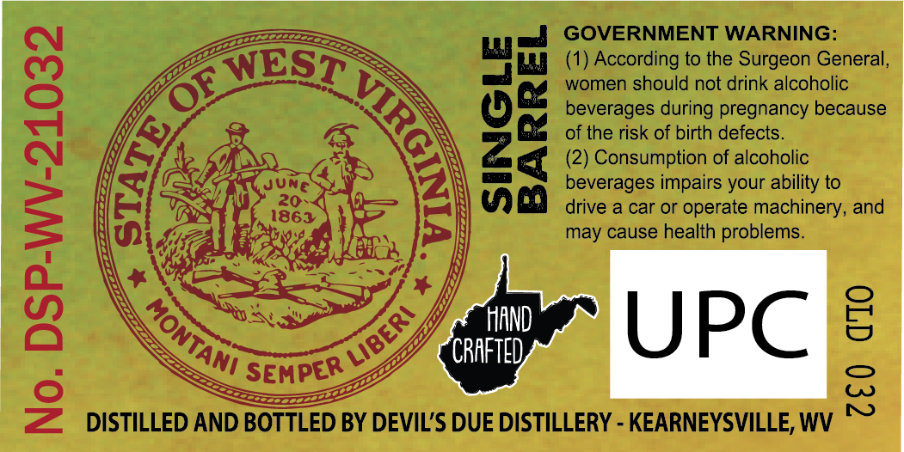
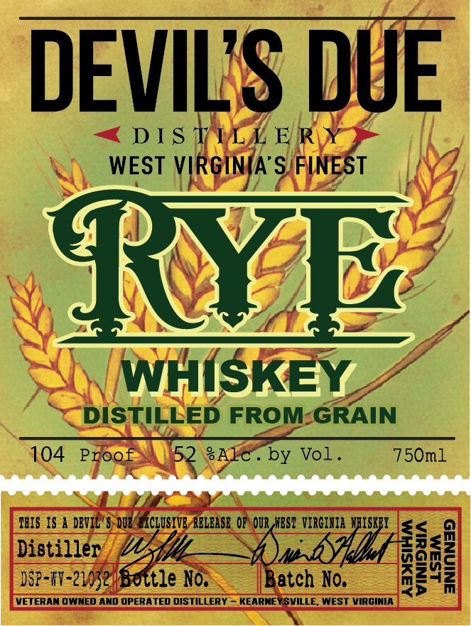
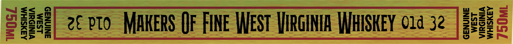

# TTB COLA Label Images - TTBID 26154001000490

**Brand Name:** DEVIL'S DUE DISTILLERY

**Issue Date:** 06/09/2026

**Origin Code:** 47

**Product Class/Type:** 142

**Source:** [TTB Public COLA Registry](https://ttbonline.gov/colasonline/viewColaDetails.do?action=publicFormDisplay&ttbid=26154001000490)

## Label Images

### Back Label

### Front Label

### Label 3

## Extracted Label Text

*Text extracted via OCR - may contain errors*

**Detected Proof:** 104

### Back Label

GOVERNMENT WARNING:

(1) According to the Surgeon General,
women should not drink alcoholic
beverages during pregnancy because
of the risk of birth defects.

(2) Consumption of alcoholic
beverages impairs your ability to

drive a car or operate machinery, and
may cause health problems.

SINGLE
BARREL

0. DSP-WV-21032

7£0 dO

— DISTILLED AND BOTTLED BY DEVIL'S DUE DISTILLERY - KEARNEYSVILLE, WV

### Front Label

DEVILIS DUE
DIS TILL E R-
WEST VIRGINIA S FINEST
SRNAE
WHISKEY
DISTILLED FROM-GRAIN
104
Proof
52
SAlc
by Vol
750ml
TBIS IS a DBVIL'$ DUK EXCLUSIVE RCLbaSE OF OUR,NEST VIRGIHIA  WhiSKFI
<
Distilleze Wale No;
Batch No.
0
I
VETERAN OWNED ANd OPERATED DISTILLERY _ KEARNEY SVILLE
WEST VIRGINIA

### Label 3

ASXSIHM

2¢ PTO MAKERS (}F FINE WEST VIRGINIA WHISKEY 01d 32

VIRGINIA
WHISKEY
