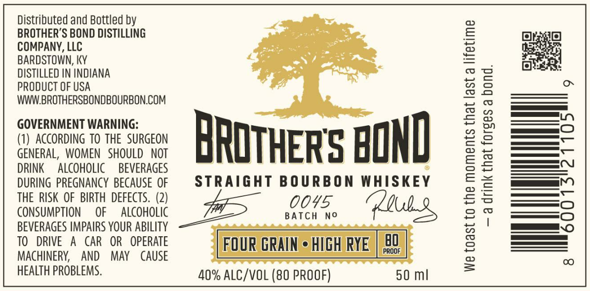

# TTB COLA Label Images - TTBID 26154001000601

**Brand Name:** BROTHER'S BOND

**Fanciful Name:** FOUR GRAIN - HIGH RYE

**Issue Date:** 06/08/2026

**Origin Code:** 22

**Product Class/Type:** 101

**Source:** [TTB Public COLA Registry](https://ttbonline.gov/colasonline/viewColaDetails.do?action=publicFormDisplay&ttbid=26154001000601)

## Label Images

### Label 1

## Extracted Label Text

*Text extracted via OCR - may contain errors*

**Detected Proof:** 80

### Label 1

Distributed and Bottled by
BROTHER'S BOND DISTILLING
COMPANY, LLC poate
BARDSTOWN, KY o&
DISTILLED IN INDIANA ak
PRODUCT OF USA
WWW.BROTHERSBONDBOURBON.COM

GOVERNMENT WARNING: } . |

(1) ACCORDING TO THE SURGEON KWHIWoD

GENERAL, WOMEN SHOULD NOT WUIAEAd OD
DRINK ALCOHOLIC BEVERAGES dulnas ox
DURING PREGNANCY BECAUSE OF STRAIGHT BOURBON WHISKEY
THE RISK OF BIRTH DEFECTS. (2) OOYS
CONSUMPTION OF ALCOHOLIC ATCA
BEVERAGES IMPAIRS YOUR ABILITY

TO DRIVE A CAR OR OPERATE [FOUR GRAIN + HIGH RYE |

MACHINERY, AND MAY CAUSE
HEALTH PROBLEMS. 40% ALC/VOL (80 PROOF) 50 ml

—a drink that forges a bond.

We toast to the moments that last a lifetime
