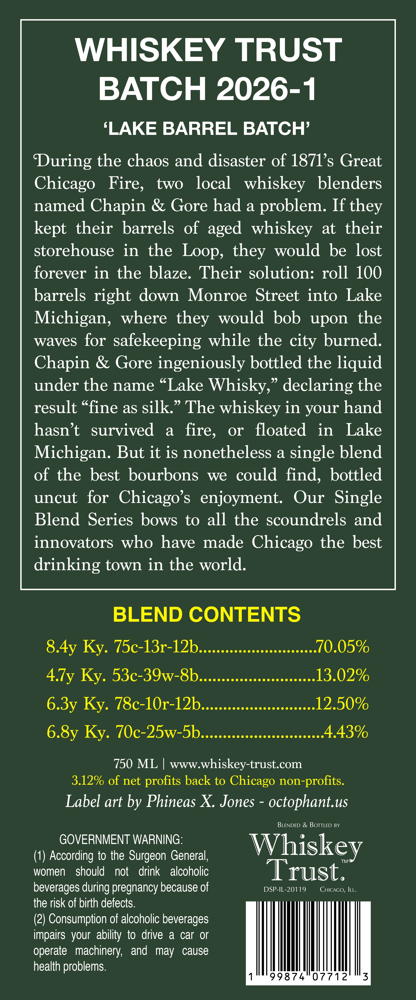
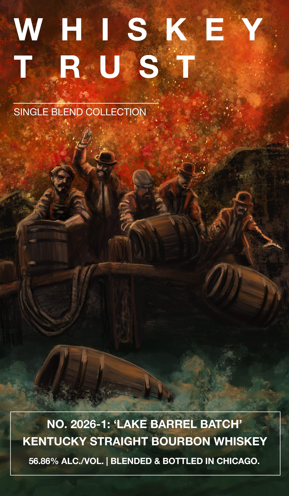

# TTB COLA Label Images - TTBID 26154001000724

**Brand Name:** WHISKEY TRUST

**Fanciful Name:** SINGLE BLEND COLLECTION

**Issue Date:** 06/10/2026

**Origin Code:** 22

**Product Class/Type:** 101

**Source:** [TTB Public COLA Registry](https://ttbonline.gov/colasonline/viewColaDetails.do?action=publicFormDisplay&ttbid=26154001000724)

## Label Images

### Back Label

### Front Label

## Extracted Label Text

*Text extracted via OCR - may contain errors*

**Detected Proof:** 113.7

### Back Label

WHISKEY TRUST

BATCH 2026-1

‘LAKE BARREL BATCH’

‘During the chaos and disaster of 1871’s Great

Chicago Fire, two local whiskey blenders

named Chapin & Gore had a problem. If they

kept their barrels of aged whiskey at their

storehouse in the Loop, they would be lost

forever in the blaze. Their solution: roll 100

barrels right down Monroe Street into Lake

Michigan, where they would bob upon the

waves for safekeeping while the city burned

Chapin & Gore ingeniously bottled the liquid

under the name “Lake Whisky,” declaring the

result “fine as silk.” The whiskey in your hand

hasn’t survived a fire, or floated in Lake

Michigan. But it is nonetheless a single blend

of the best bourbons we could find, bottled

uncut for Chicago’s enjoyment. Our Single

Blend Series bows to all the scoundrels and

innovators who have made Chicago the best

drinking town in the world

BLEND CONTENTS

S.Ay Ky. 75c-13r-12b... ee eeeeeeeeeees 10.05%

4.7y Ky. 53c-39w-8b

13.02%

6.3y Ky. 78c-10r-12b

@eeeeee@eeeeeeeaeeeaeeeaoeaeaeoeoeaeed

12.50%

6.8y Ky. 70c-25w-Sb.........sccsssccccceeeeeeee 4.43%

750 ML | www.whiskey-trust.com

3.12% of net profits back to Chicago non-profits

Label art by Phineas X. Jones - octophant.us

LENDED & BOTTLED BY

GOVERNMENT WARNING

Whiskey

(1) According to the Surgeon General

women should not drink alcoholic

Trust.

beverages during pregnancy because of

DSP-IL-20119 CHI

the risk of birth defects

(2) Consumption of alcoholic beverages

impairs your ability to drive a car or

operate machinery, and may cause

health problems

1

99874 07712

3

### Front Label

W
H |
S
K E
Y
T
R
U
S
T
SINGLE BLEND COLLECTION
NO. 2026-1:
LAKE BARREL BATCH'
KENTUCKY STRAIGHT BOURBON WHISKEY
56.86% ALC NOL
BLENDED & BOTTLED IN CHICAGO_
