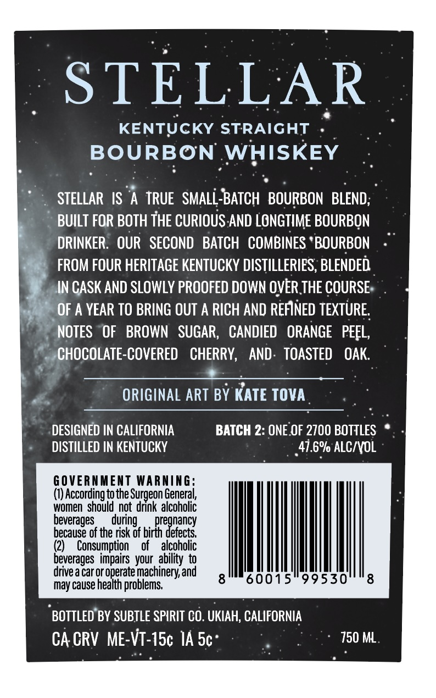
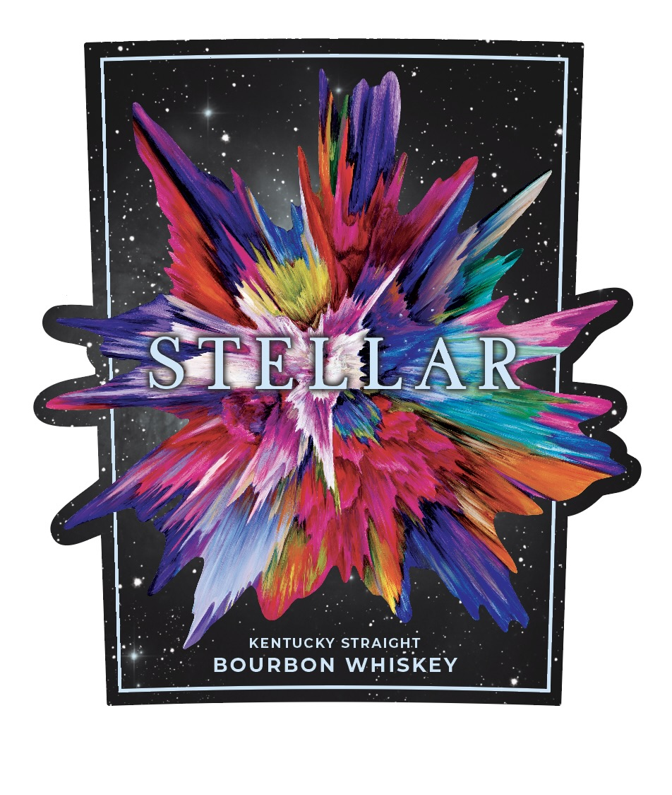

# TTB COLA Label Images - TTBID 26154001000774

**Brand Name:** SUBTLE SPIRITS

**Fanciful Name:** STELLAR

**Issue Date:** 06/16/2026

**Origin Code:** 01

**Product Class/Type:** 101

**Source:** [TTB Public COLA Registry](https://ttbonline.gov/colasonline/viewColaDetails.do?action=publicFormDisplay&ttbid=26154001000774)

## Label Images

### Back Label

### Front Label

## Extracted Label Text

*Text extracted via OCR - may contain errors*

**Detected Proof:** 95.2

### Back Label

STELLAR
KENTUCKY STRAIGHT
BOURBON WHISKEY
STELLAR IS
A TRUE   SMALL-BATCH  BOURBON  BLEND;
BUILT FOR BOTH THE CURIOUS AND LONGTIME BOURBON
DRINKER;
OUR   SECOND  BATCH   COMBINES ' BOURBON
FROM FOUR HERITAGE KENTUCKY DISTILLERIES; BLENDED
IN CASK AND SLOWLY PROOFED DOWN OVER THE COURSE
OF A YEAR TO BRING OUT A RICH AND REFINED TEXTURE
NOTES
OF
BROWN   SUGAR,
CANDIED   ORANGE   PEEL,
CHOCOLATE-COVERED
CHERRY,
AND:  TOASTED
OAK
ORIGINAL ART BY KATE TOVA
DESIGNED IN CALIFORNIA
BATCH 2: ONE OF 2700 BOTTLES
DISTILLED IN KENTUCKY
47.6% ALC/VOL
6 OVERNMENT Warning;
(€) According tothe Surgeon General,
women  should not  drink alcoholic
beverages_
during ,
pregnancy
because of the risk of birth defects.
(2)
Consumption
of
alcoholic
beverages   impairs your  ability to
drive a car or operate machinery; and
may cause health problems:
8
60015
99530
8
BOTTLED BY SUBTLE SPIRIT CO. UKIAH; CALIFORNIA
CA CRV  ME-VT-15c IA 5c
750 ML

### Front Label

STELL AR
KENTUCKY STRAIGHT
BOURBON
WHISKEY
