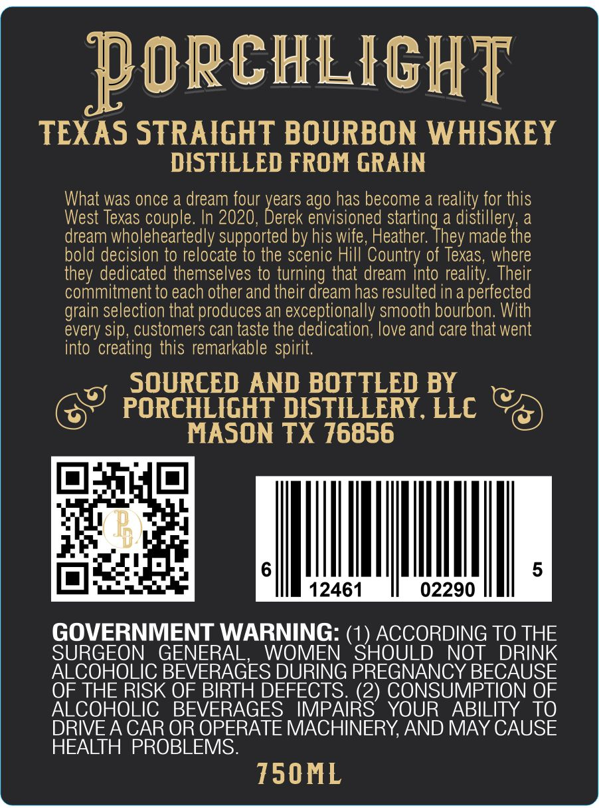
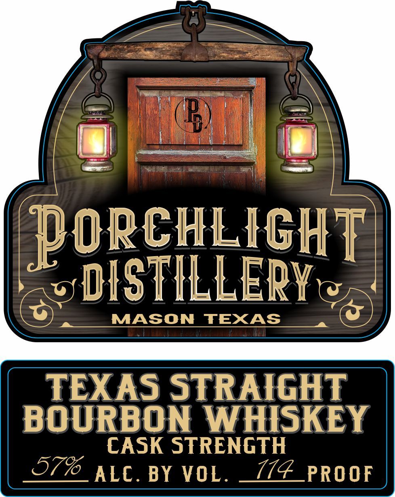

# TTB COLA Label Images - TTBID 26154001000779

**Brand Name:** PORCHLIGHT DISTILLERY

**Issue Date:** 06/24/2026

**Origin Code:** 44

**Product Class/Type:** 101

**Source:** [TTB Public COLA Registry](https://ttbonline.gov/colasonline/viewColaDetails.do?action=publicFormDisplay&ttbid=26154001000779)

## Label Images

### Back Label

### Front Label

## Extracted Label Text

*Text extracted via OCR - may contain errors*

### Back Label

poRcHLIGHT
TEXAS STRAIGHT BOURBON WHISKEY
DISTILLED FROM GRAIN
What was once a dream four
ago has become a reality for this
West
couple. In 2020,
Deaes
envisioned
distil
dream wholeheartedly supported by his wife;, Heather.
made the
bold decision to relocate to the scenic Hill Country of Texas, where
dedicated themselves to turning that dream into reality: Their
commitment to each other and their dream has resulted in a perfected
selection that produces an exceptionally smooth bourbon: With
every sip, customers can taste the dedication; love and care that went
into
'creating this remarkable spirit:
SOURCED AND BOTTLED BY
PORCHLIGHT DISTILLERY, LLC
MASON TX 76856
5
12461
02290
GOVERNMENT WARNING: (1) ACCORDING TO THE
SURGEON
GENERAL,
WOMEN
SHOULD
NOT
DRINK
ALCOHOLIC BEVERAGES DURING PREGNANCY BECAUSE
OF THE RISK OF BIRTH DEFECTS (2) CONSUMPTION OF
ALCOHOLIC
BEVERAGES IMPAIRS
YOUR
ABILITY
To
DRIVE A CAR OR OPERATE MACHINERY,AND MAY CAUSE
HEALTH PROBLEMS:
750ML
Texas
starting
illery;
They
they
grain

### Front Label

B
pORcHLIGHT
DISTILLERYt
0
MASON
TEXAS
TEXAS STRAIGHT
BOURBON WHISKEY
CASK STRENGTH
579_ALC.
BY VOL .
114_PROOF
