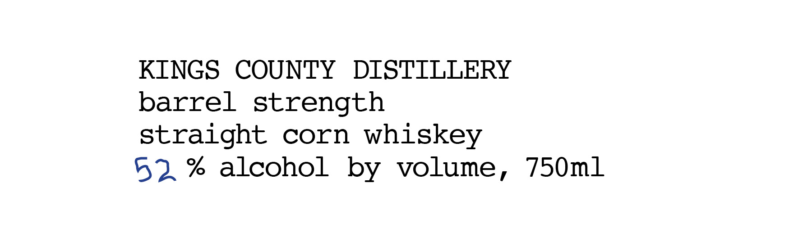
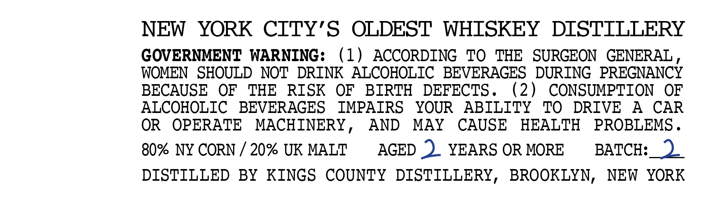

# TTB COLA Label Images - TTBID 26154001000808

**Brand Name:** KINGS COUNTY DISTILLERY

**Issue Date:** 06/09/2026

**Origin Code:** 02

**Product Class/Type:** 103

**Source:** [TTB Public COLA Registry](https://ttbonline.gov/colasonline/viewColaDetails.do?action=publicFormDisplay&ttbid=26154001000808)

## Label Images

### Label 1

### Label 2

## Extracted Label Text

*Text extracted via OCR - may contain errors*

**Detected Proof:** 104
**Detected Age:** 2 Years

### Label 1

KINGS COUNTY DISTILLERY

barrel strength

straight corn whiskey

52% alcohol by volume, 750m1

### Label 2

NEW
YORK CITY'S
OLDEST WHTSKEY DISTTLLERY
GOVERNMENT WARNING:
1)
ACCORDING
To
THE
SURGEON
GENERAL
WOMEN
SHOULD NOT DRINK
ALCOHOLIC BEVERAGES
DURING  PREGNANCY
BECAUSE
OF
THE
RISK
OF
BIRTH
DEFECTS _
(2)
CONSUMPTION
OF
ALCOHOLIC
BEVERAGES
IMPAIRS
YOUR
ABILITY
To
DRIVE
A
CAR
OR
OPERATE
MACHINERY
AND
MAY
CAUSE
HEALTH
PROBLEMS _
80% NY CORN
20% UK MALT
AGED 2
YEARS OR MORE
BATCH:
DISTILLED
BY
KINGS
COUNTY DISTILLERY, BROOKLYN,
NEW
YORK
