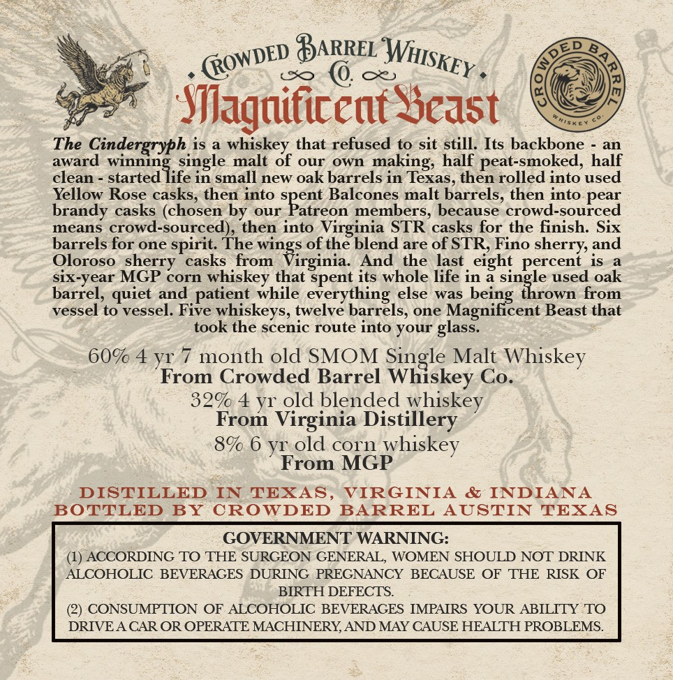
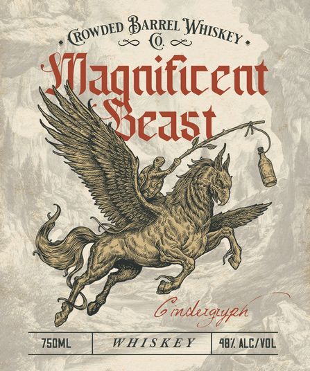

# TTB COLA Label Images - TTBID 26154001000821

**Brand Name:** MAGNIFICENT BEAST

**Fanciful Name:** CINDERGRYPH

**Issue Date:** 06/09/2026

**Origin Code:** 44

**Product Class/Type:** 140

**Source:** [TTB Public COLA Registry](https://ttbonline.gov/colasonline/viewColaDetails.do?action=publicFormDisplay&ttbid=26154001000821)

## Label Images

### Back Label

### Front Label

## Extracted Label Text

*Text extracted via OCR - may contain errors*

### Back Label

BARREL
Sfiagadiceat Seast
The Cindergryph is
whiskey that refused to sit still. Its backbone
an
award
winning.single malt of our
own
making; half peat-smoked, half
clean
started life in small new oak barrels in Texas, then rolled into used
Yellow Rose casks, then into
Balcones malt barrels, then into pear
brandy
casks (chosen by
our
SPeteBa ceebera,t becaele cfendntupeed
means crowd-sourced)
then into Virginia STR casks for the finish: Six
barrels for one
'spirit: The wings of the blend are of STR; Fino
Oloroso   sherry
casks
Virginia
And
the last , eight
Pehez =
is
six-year MGP corn whiskey that spent its whole life in 3 single used oak
barrel,
and patient while everything else
was
thrown from
vessel to vessel. Five
whiskeys, twelve barrels; one Magnificent Beast that
took the scenic route into your
609 4 y
month old SMOM
Malt Whiskey
From Crowded Barrel
Siilken
Co.
329 4 yr_old blended
whiskey
From Virginia Distillery
8% 6 yr_old corn
whiskey
From MGP
DISTILLED
TEXAS,
VIRGINIA
&
INDIANA
BOTTLED
BY
CROWDED
BARREL
AUSTIN
TEXAS
GOVERNMENT WARNING:
(1) ACCORDING TO THE SURGEON GENERAL, WOMEN SHOULD NOT DRINK
ALCOHOLIC BEVERAGES DURING PREGNANCY BECAUSE OF
THE
RISK OF
BIRTH DEFECTS.
CONSUMPTION OF ALCOHOLIC BEVERAGES IMPAIRS YOUR ABILITY TO
DRIVEA CAR OR OPERATE MACHINERYAND MAY CAUSE HEALTH PROBLEMS_
WHISKEY
(ROWDED
and
from
being
quiet
glass,
IN

### Front Label

Gone BARE Wis

q So
Maguificent
WAL

Scast

SSS ESM A
Gigs”?
Fad Cisulesgyph *
