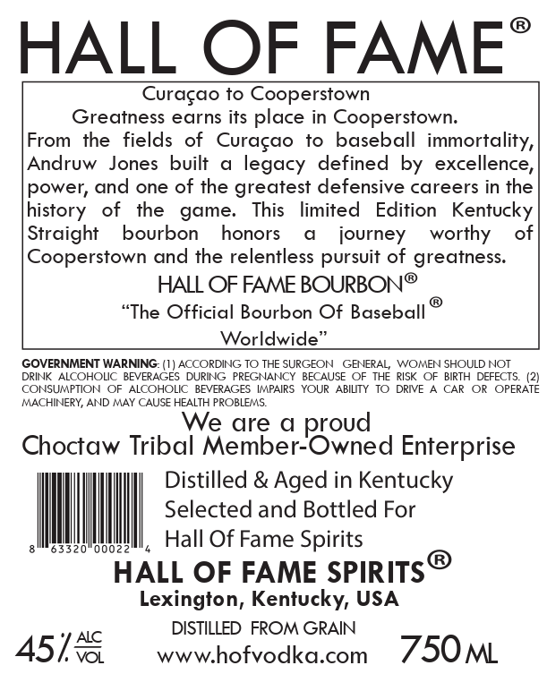
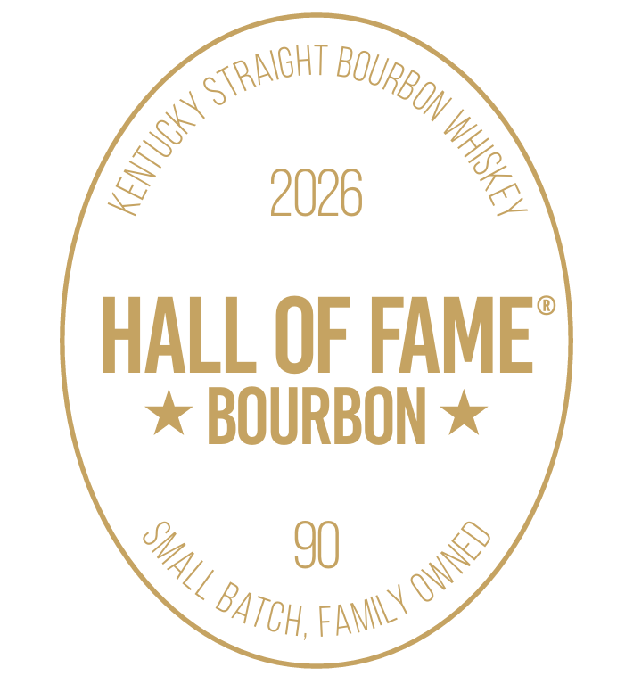
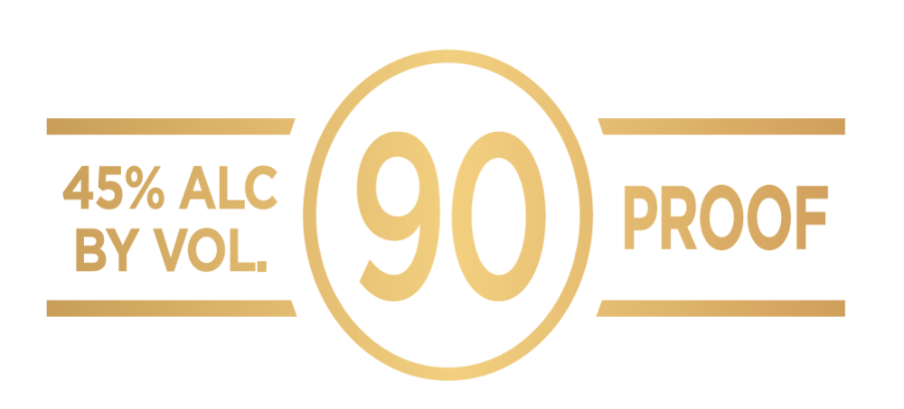

# TTB COLA Label Images - TTBID 26155001000037

**Brand Name:** HALL OF FAME

**Fanciful Name:** 90

**Issue Date:** 06/16/2026

**Origin Code:** 22

**Product Class/Type:** 101

**Source:** [TTB Public COLA Registry](https://ttbonline.gov/colasonline/viewColaDetails.do?action=publicFormDisplay&ttbid=26155001000037)

## Label Images

### Back Label

### Front Label

### Label 2

## Extracted Label Text

*Text extracted via OCR - may contain errors*

*1 image(s) excluded: text did not meet readability threshold*

### Back Label

HALL OF FAME
Curacao to Cooperstown
Greatness earns its place in Cooperstown:
From
the
fields of Curacao
to
baseball immortality,
Andruw
Jones
built
legacy
defined by excellence,
power; and one of the greatest defensive careers in the
history
of
the
game:
This
limited
Edition
Kentucky
Straight
bourbon
honors
journey
worthy
of
Cooperstown and the relentless pursuit of greatness:
HALL OF FAME BOURBON@
"The Official Bourbon Of Baseball
Worldwide
GOVERNMENT WARNING: (1) ACCORDING TO THE SURGEON
GENERAL;
WOMEN SHOULD NOT
DRINK
ALCOHOLIC
BEVERAGES
DURING
PREGNANCY
BECAUSE
OF THE RISK
OF  BIRTH DEFECTS
CONSUMPTION
OF ALCOHOLIC
BEVERAGES IMPAIRS YOUR
ABIUTY
TO DRIE
CAR
OR  OPERATE
MACHINERY; AND MAY CAUSE HEALTH PROBLEMS:
We are
d
Choctaw Tribal Member-Owned Enterprise
Distilled & Aged in Kentucky
Selected and Bottled For
0002
Hall Of Fame Spirits
HALL OF FAME SPIRITS
Lexington, Kentucky; USA
DISTILLED FROM GRAIN
4515
wwwhofvodka.com
750M
proud

### Front Label

2026
HALL OF FAME
BOURBON
90
STRAIGHT ,
BOURBON /
8
8
2
FAMLY owNeD
BATCh ,
