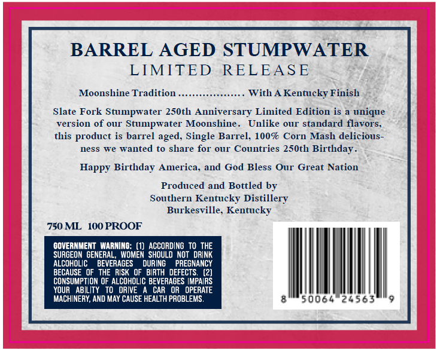
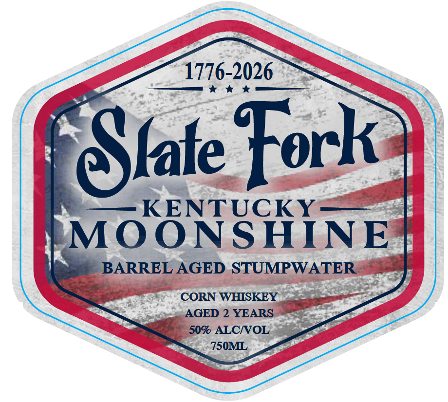

# TTB COLA Label Images - TTBID 26155001000130

**Brand Name:** SLATE FORK

**Issue Date:** 06/15/2026

**Origin Code:** 22

**Product Class/Type:** 143

**Source:** [TTB Public COLA Registry](https://ttbonline.gov/colasonline/viewColaDetails.do?action=publicFormDisplay&ttbid=26155001000130)

## Label Images

### Back Label

### Front Label

### Label 3

## Extracted Label Text

*Text extracted via OCR - may contain errors*

*1 image(s) excluded: text did not meet readability threshold*

**Detected Age:** 2 Years

### Back Label

BARREL AGED STUMPWATER
LIMITED
RELEASE
Moonshine Tradition
With A Kentucky Finish
Slate Fork Stumpwater 250th Anniversary Limited Edition is a unique
version of OUr" Stumpwater Moonshine _
Unlike
OuT
tandard flavors.
this product is barrel aged,
Single Barrel; 100F
Mash delicious-
ness
we wanted
to share for Our Countries 250th Birthday
Happy Birthday America; and God Bless Our Great Nation
Produced and Bottled by
Southern Kentucky
Distillery
Burkesville. Kentucky
750 ML
10O PROOF
COVERNMENT WARNINO:
ACCORDING TO THE
SURGEOM GENERAL
WOMEN  SHOULD NOT   DRINK
ALCOHOLIC
BEVERAGES
DURING
PREGNANCY
BECAUSE
THE   RISK
OF   BIRTH   DEFECTS.
CONSUMPTION OF ALCOHOLIC BEVERAGES IMPAIRS
YOuR
ABILITY
DRIVE
CAR
OPERATE
MACHINERY, AND MAY CAUSE HEALTH PROBLEMS,
50064 20563
Corn

### Front Label

1776-2026
Slate Fork
~KENTUCKY
MOONSHINE
BARREL AGED STUMPWATER
CORN WHISKEY
AGED 2 YEARS
509 ALCNOL
750ML
