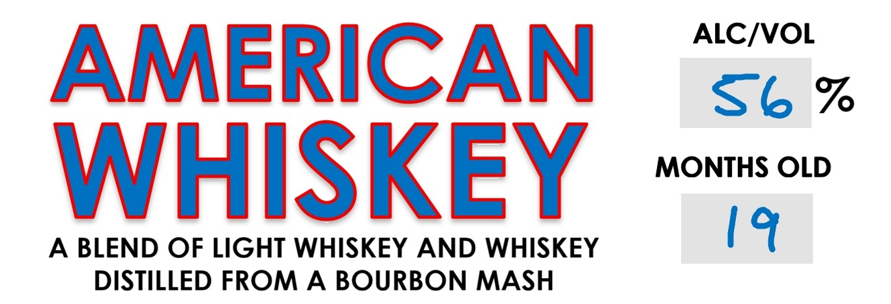
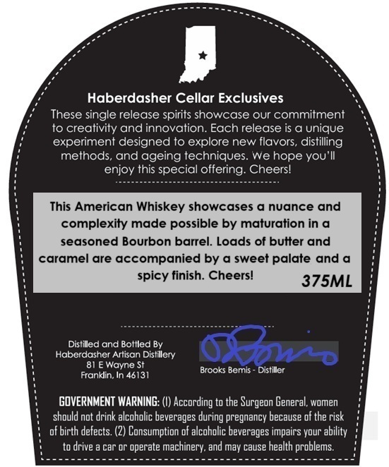

# TTB COLA Label Images - TTBID 26155001000493

**Brand Name:** CELLAR EXCLUSIVES

**Issue Date:** 06/10/2026

**Origin Code:** 19

**Product Class/Type:** 140

**Source:** [TTB Public COLA Registry](https://ttbonline.gov/colasonline/viewColaDetails.do?action=publicFormDisplay&ttbid=26155001000493)

## Label Images

### Label 1

### Label 2

### Label 3

## Extracted Label Text

*Text extracted via OCR - may contain errors*

*1 image(s) excluded: text did not meet readability threshold*

### Label 2

ALCIVOL
AMERICAN
S6
%
WHISKEY
MONTHS OLD
A
BLEND OF LIGHT WHISKEY AND WHISKEY
19
DISTILLED FROM
A BOURBON MASH

### Label 3

Haberdasher Cellar Exclusives

These single release spirits showcase our commitment
to creativity and innovation. Each release is a unique
experiment designed to explore new flavors, distiling
methods, and ageing techniques. We hope you'll
enjoy this special offering. Cheers!

This American Whiskey showcases a nuance and
complexity made possible by maturation ina
seasoned Bourbon barrel. Loads of butter and

caramel are accompanied by a sweet palate anda
spicy finish. Cheers!

Distilled and Bottled By
Haberdasher Artisan Distilery
81 E Wayne St

Frond 46131 Brooks Bemis - Distiller

GOVERNMENT WARNING: (1) According to the Surgeon General, women
should not drink alcoholic beverages during pregnancy because ofthe risk
of birth defects. (2) Consumption of alcoholic beverages impairs your ability
to drive a car or operate machinery, and may cause health problems.
