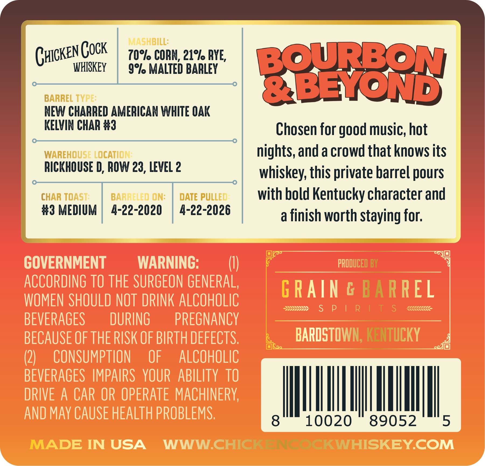
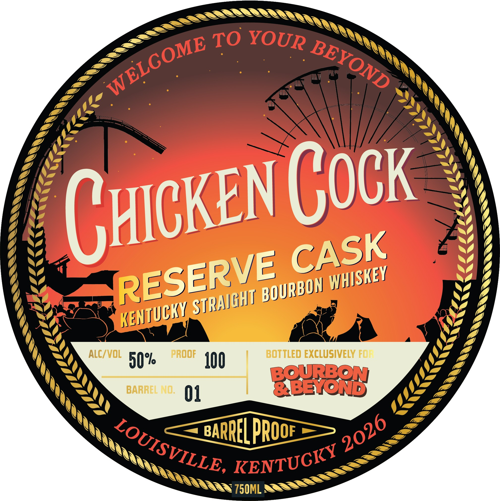

# TTB COLA Label Images - TTBID 26155001000520

**Brand Name:** CHICKEN COCK

**Issue Date:** 06/09/2026

**Origin Code:** 22

**Product Class/Type:** 101

**Source:** [TTB Public COLA Registry](https://ttbonline.gov/colasonline/viewColaDetails.do?action=publicFormDisplay&ttbid=26155001000520)

## Label Images

### Back Label

### Front Label

## Extracted Label Text

*Text extracted via OCR - may contain errors*

**Detected Proof:** 100

### Back Label

MAShBILL:
Ghicken Gock
z0%l CORN; 21% RYE,
BOuRBON
WHISKEY
9%l MALTED BARLEY
BARREL TYPE:
&BEYOND
NEW CHARRED AMERICAN WHITE OAK
KELVIN CHAR #3
Chosen for good music; hot
WAREHOUSE LOCATION
nights, and a crowd that knows its
RICKHOUSE D, ROW 23, LEVEL 2
whiskey; this private barrel pours
CHAR TOAST:
BARRELED ON:
DATE PULLED
with bold Kentucky character and
#3 MEDIUM
4-22-2020
4-22-2026
a finish worth staying for;
GOVERNMENT
WARNING:
PRODUCED BY
ACCORDING TO THE SURGEON GENERAL,
G RAIN € BARREL
WOMEN SHOULD NOT DRINK ALCOHOLIC
S
P
R
T
S
BEVERAGES
DURING
PREGNANCY
BECAUSE OF THE RISK OF BIRTH DEFECTS,
BARDSTOWN; KENTuCKY
(2)
CONSUMPTION
OF
ALCOHOLIC
BEVERAGES   IMPAIRS   YOUR   ABILITY TO
DRIVE A CAR OR OPERATE MACHInERY;
AND MAY CAUSE HEALTH PROBLEMS;
8
10020
89052
5
MADE IN USA
WWW CHICK ACKWHISKEYCOM

### Front Label

Chicken Cock
ALC/VOL
prOOF
BOTTLED EXCLUSIVELY FO:
50%
J00
BOURBON
BARREL NO:
01
&BEYOND
BARREL Proof
750ML
LCCC
TO
YOUR
WELGOME
BEYOND
1
CASK
RESERVE
YHISKEY
BOURBON
STRA]GHT
(
KENtucky
4tililst>
2026
LOUISVILLE,
KENTUGKY
