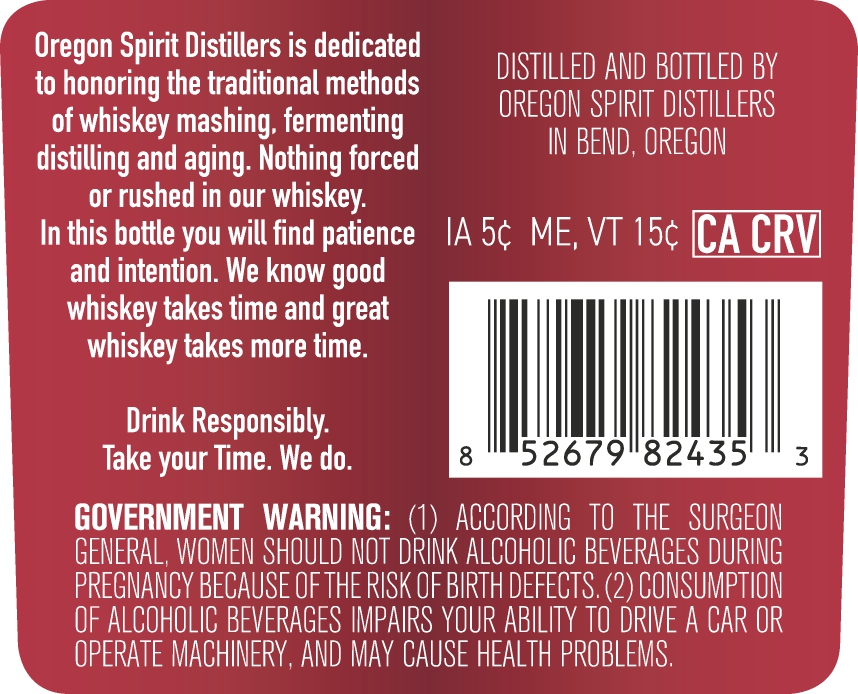
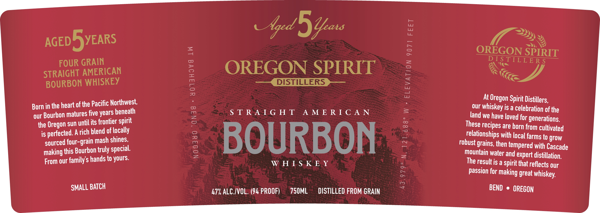

# TTB COLA Label Images - TTBID 26155001000523

**Brand Name:** OREGON SPIRIT DISTILLERS

**Issue Date:** 06/09/2026

**Origin Code:** 38

**Product Class/Type:** 141

**Source:** [TTB Public COLA Registry](https://ttbonline.gov/colasonline/viewColaDetails.do?action=publicFormDisplay&ttbid=26155001000523)

## Label Images

### Back Label

### Front Label

### Label 3

## Extracted Label Text

*Text extracted via OCR - may contain errors*

**Detected Proof:** 94
**Detected Age:** 5 Years

### Back Label

Oregon Spirit Distillers is dedicated

DISTILLED AND BOTTLED BY

to honoring the traditional methods

of whiskey mashing fermenting

OREGON SPIRIT DISTILLERS

distilling and aging. Nothing forced

IN BEND, OREGON

or rushed in our whiskey.

In this bottle you will find patience 1A 5¢ ME, VT 15¢ [CA CRY]

and intention. We know good

whiskey takes time and great

whiskey takes more time

Drink Responsibly.

|

Take your Time. We do

52679

82435

GOVERNMENT WARNING: (1) ACCORDING 10 THE SURGEON

GENERAL, WOMEN SHOULD NOT DRINK ALCOHOLIC BEVERAGES DURING

PREGNANCY BECAUSE OF THE RISK OF BIRTH DEFECTS. (2) CONSUMPTION

OF ALCOHOLIC BEVERAGES IMPAIRS YOUR ABILITY TO DRIVE A CAR OR

OPERATE MACHINERY, AND MAY CAUSE HEALTH PROBLEMS

### Front Label

eal ee

ee

CZ

is

Gyed. Yeats

Dy

yy

AGED Byars

~~

OREGON

SPIRIT

FOUR GRAIN

DISTILLERS

OREGON SPIRIT

STRAIGHT AMERICAN

iN ACY

tc

BOURBON WHISKEY

ome DISTILLERS Joe

At Oregon Spirit Distillers,

Born in the heart of the Pacific Northwest,

our Whiskey is a celebration of the

our Bourbon matures five years heneath

STRAIGHT AMERICAN

the Oregon sun until its frontier spirit

land we have loved for generations.

These recipes are horn from cultivated

is perfected. A rich blend of locally

relationships with local farms to grow

sourced four-grain mash shines,

robust grains, then tempered with Cascade

making this Bourbon truly special.

BOURBON

mountain water and expert distillation,

From our family’s hands to yours.

WHISKEY

The result is a Spirit that reflects our

Passion for making great whiskey.

SMALL BATCH

47%, ALC.IVOL. (94 PROOF)

750ML

DISTILLED FROM GRAIN

BEND © OREGON

### Label 3

STRAIGHT AMERICAN

BOURBON WHISKEY

AGED 5 YEARS
