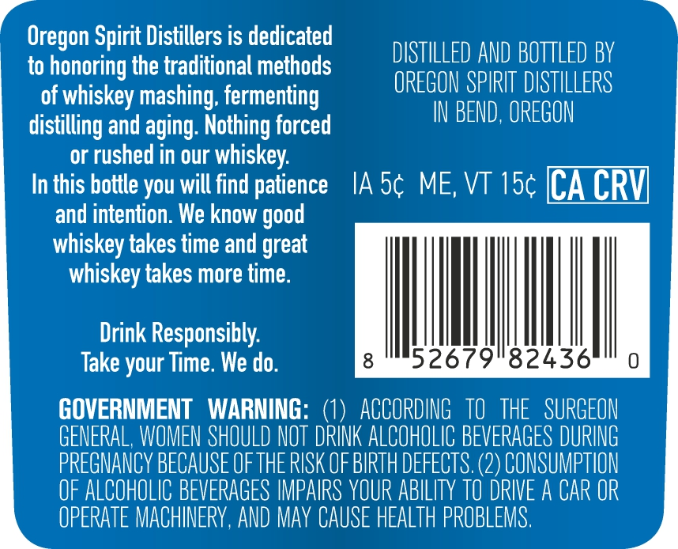
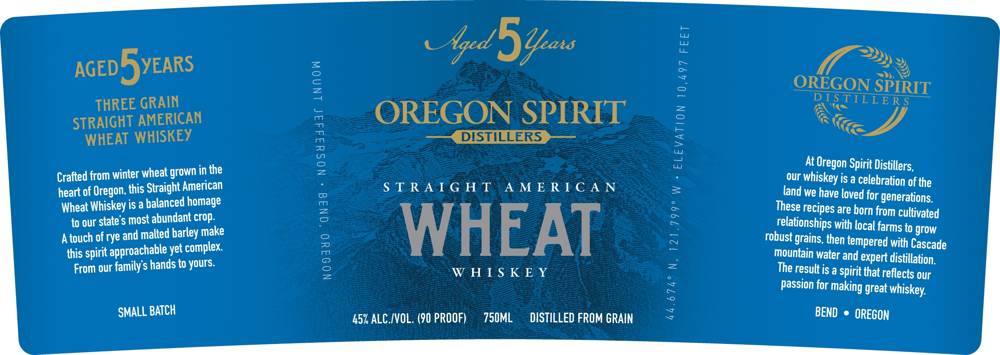

# TTB COLA Label Images - TTBID 26155001000534

**Brand Name:** OREGON SPIRIT DISTILLERS

**Issue Date:** 06/09/2026

**Origin Code:** 38

**Product Class/Type:** 140

**Source:** [TTB Public COLA Registry](https://ttbonline.gov/colasonline/viewColaDetails.do?action=publicFormDisplay&ttbid=26155001000534)

## Label Images

### Back Label

### Front Label

### Label 3

## Extracted Label Text

*Text extracted via OCR - may contain errors*

**Detected Proof:** 90
**Detected Age:** 5 Years

### Back Label

Oregon Spirit Distillers is dedicated
DISTILLED AND BOTTLED BY
to honoring the traditional methods
OREGON SPIRIT DISTILLERS
of whiskey mashing; fermenting
IN BEND, OREGON
distilling and aging: Nothing forced
or rushed in our whiskey:
In this bottle you will find patience
IA Sc ME, VT 15c [CA CRV]
and intention. We know
whiskey takes time and great
whiskey takes more time:
Drink Responsibly:
Take your Time. We do.
8
52679"82436
GOVERNMENT
WARNING:
ACCORDING   to   THE   SURGEON
GENERAL, WOMEN SHOULD NOT DRINK ALCOHOLIC BEVERAGES DURING
PREGNANCY BECAUSE OFTHE RISK OF BIRTH DEFECTS (2) CONSUMPTION
OF ALCOHOLIC BEVERAGES IMPAIRS YOUR ABILITY TO DRIVE A CAR OR
OPERATE MACHINERY, AND May CAUSe HEALTh PROBLEMS .
good

### Front Label

ore

MES

g

ey

o

~

=>, Sy,

AGED F)YEARS

a

(—)

OREGON SPIRIT

=

THREE GRAIN

=

DES Tim

PA

L

-LERS

OREGON SPIRIT

=}

STRAIGHT AMERICAN

=

ee

WHEAT WHISKEY

pemem DISTILLERS eee

>

aa

tu

uw

At Oregon Spirit Distillers,

Crafted from winter wheat grown in the

our whiskey is a celebration of the

heart of Oregon, this Straight American

STRAIGHT AMERICAN

=

Wheat Whiskey is a balanced homage

land we have loved for generations.

to our state’s most abundant crop.

These recipes are horn from cultivated

relationships with local farms to grow

Atouch of rye and malted harley make

robust grains, then tempered with Cascade

this spirit approachable yet complex.

WHEAT

mountain water and expert distillation,

From our family’s hands to yours.

WHISKEY

The result is a Spirit that reflects our

Passion for making great whiskey,

SMALL BATCH

45%, ALC./VOL. (90 PROOF)

750ML

DISTILLED FROM GRAIN

BEND © OREGON

### Label 3

STRAIGHT AMERICAN
WHEAT WHISKEY
AGED 5 YEARS
