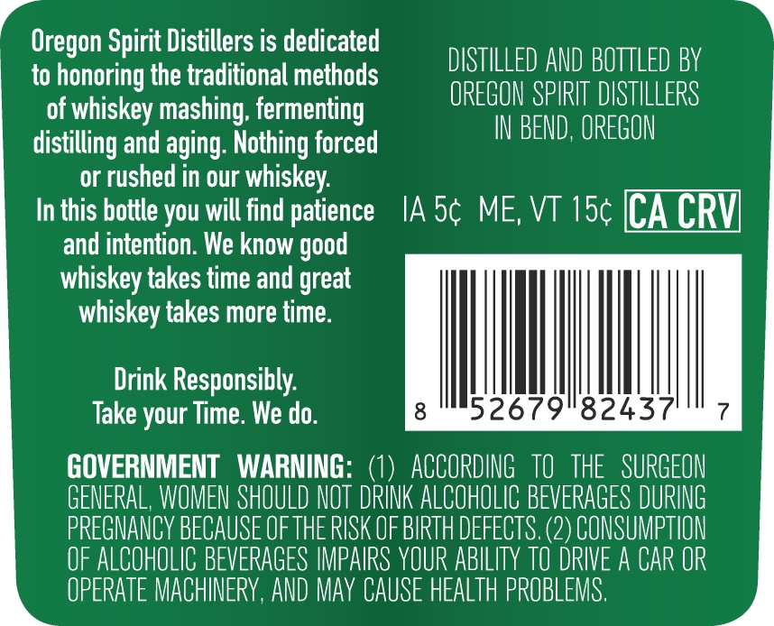
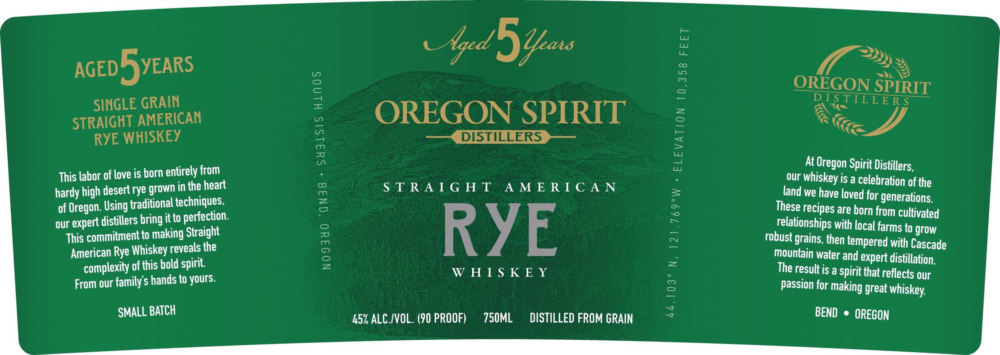

# TTB COLA Label Images - TTBID 26155001000542

**Brand Name:** OREGON SPIRIT DISTILLERS

**Issue Date:** 06/09/2026

**Origin Code:** 38

**Product Class/Type:** 142

**Source:** [TTB Public COLA Registry](https://ttbonline.gov/colasonline/viewColaDetails.do?action=publicFormDisplay&ttbid=26155001000542)

## Label Images

### Back Label

### Front Label

### Label 3

## Extracted Label Text

*Text extracted via OCR - may contain errors*

**Detected Proof:** 90
**Detected Age:** 5 Years

### Back Label

Oregon Spirit Distillers is dedicated

>)

DISTILLED AND BOTTLED BY

to honoring the traditional methods

OREGON SPIRIT DISTILLERS

of whiskey mashing, fermenting

IN BEND, OREGON

distilling and aging. Nothing forced

or rushed in our whiskey.

In this bottle you will find patience IA 5¢ ME, VT 15¢ ICA CRV

and intention. We know good

whiskey takes time and great

whiskey takes more time.

Drink Responsibly.

WM

Take your Time. We do.

GOVERNMENT WARNING: (1) ACCORDING TO THE SURGEON

GENERAL, WOMEN SHOULD NOT DRINK ALCOHOLIC BEVERAGES DURING

PREGNANCY BECAUSE OF THE RISK OF BIRTH DEFECTS. (2) CONSUMPTION

OF ALCOHOLIC BEVERAGES IMPAIRS YOUR ABILITY TO DRIVE A CAR OR

OPERATE MACHINERY, AND MAY CAUSE HEALTH PROBLEMS

### Front Label

an

i 7

ES

ped

)

»)

0)

~~,

AGED BEARS

OREGON

SPIRIT

DISTILLERS

SINGLE GRAIN

Ae

FS

STRAIGHT AMERICAN

OREGON SPIRIT

rc

RYE WHISKEY

eee, DISTILLERS Jee

Kod

This labor of love is born entirely from

At Oregon Spirit Distillers,

STRAIGHT AMERICAN

our whiskey is a celebration of the

hardy high desert rye grown in the heart

land we have loved for generations,

of Oregon. Using traditional techniques,

These recipes are born from cultivated

our expert distillers bring itto perfection

This commitment to making Straight

relationships with local farms to grow

RYE

robust grains, then tempered with Cascade

American Rye Whiskey reveals the

mountain water and expert distillation.

complexity of this bold spirit.

WHISKEY

The result is a spirit that reflects our

From our family’s hands to yours.

Passion for making great whiskey.

SMALL BATCH

—

45% ALC./VOL. (90 PROOF)

750ML

DISTILLED FROM GRAIN

BEND © OREGON

### Label 3

STRAIGHT AMERICAN

RYE WHISKEY

AGED 5 YEARS
