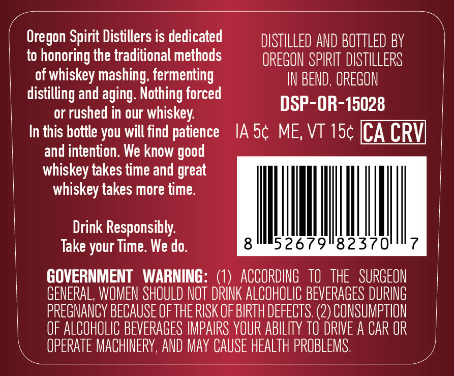
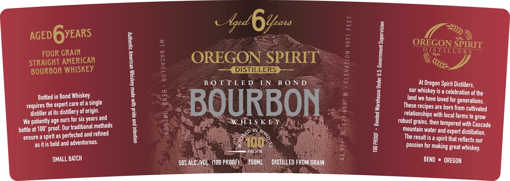

# TTB COLA Label Images - TTBID 26155001000550

**Brand Name:** OREGON SPIRIT DISTILLERS

**Issue Date:** 06/12/2026

**Origin Code:** 38

**Product Class/Type:** 111

**Source:** [TTB Public COLA Registry](https://ttbonline.gov/colasonline/viewColaDetails.do?action=publicFormDisplay&ttbid=26155001000550)

## Label Images

### Back Label

### Front Label

### Label 2

## Extracted Label Text

*Text extracted via OCR - may contain errors*

*1 image(s) excluded: text did not meet readability threshold*

**Detected Proof:** 100

### Back Label

Oregon Spirit Distillers is dedicated
DISTILLED AND BOTTLED BY
to honoring the traditional methods
OREGON SPIRIT  DSTILLERS
of whiskey mashing; fermenting
IN BEND, OREGON
distilling and aging: Nothing forced
DSP-OR-15028
or rushed in our whiskey:
In this bottle you will find patience
IA 5c ME; VT 15c [CA CRV]
and intention. We know
whiskey takes time and great
whiskey takes more time:
Drink Responsibly:
Take your Time We do.
8
52679"82370
GOVERNMENT
WARNING:
1)  ACCORDING   TO  THE   SURGEON
GENERAL, WOMEN SHOULD NOT DRINK ALCOHOLIC BEVERAGES DURING
PREGNANCV BECAUSE OFTHE RISK OF BIRTH DEFECTS. (2) CONSUMPTION
OF ALCOHOLIC BEVERAGES IMPAIRS YOUR ABILITY tO DRIVE A CAR OR
OPERATE MACHINERY,AND May CAUSE HEALTH PROBLEMS .
good

### Front Label

=

Aged

6

ba

<2)

2s

) Sy

mS

/)

AGED GYEARS

OREGON SPIRIT

DISTILLERS

FOUR GRAIN

(SS

STRAIGHT AMERICAN

OREGON SPIRIT

Gee DISTILLERS Zee

Ne ce

BOURBON WHISKEY

BAO T-£-L: E D--EN BOND

.

At Oregon Spirit Distillers,

our whiskey is a celebration of the

Bottled in Bond Whiskey

land we have loved for generations,

requires the expert care ofa single

:

distiller at its distillery of origin.

BOURBON

fF

These recipes are horn from cultivated

age ours for six years and

WHE S K- Ey

eee

~

relationships with local farms to grow

We patiently

ditional methods

robust grains, then tempered with Cascade

boitle at 100°

proof. Our tra

<S

DIN 25

Mountain water and expert distillation,

ensure a spirit as perf

ected and refined

The resultis a spirit that reflects our

as it is bold and adventurous.

= 100

rs

——s PROOF

Passion for making great whiskey,

SMALL BATCH

a

50% AECIIVOL, (100 PROOF)

730ML

DISHULED- FROM-GRAIN

BEND © OREGON
