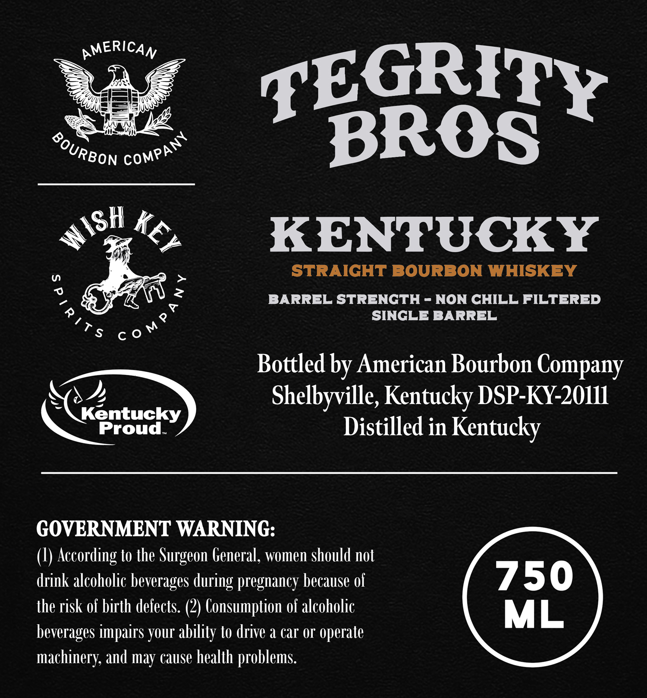
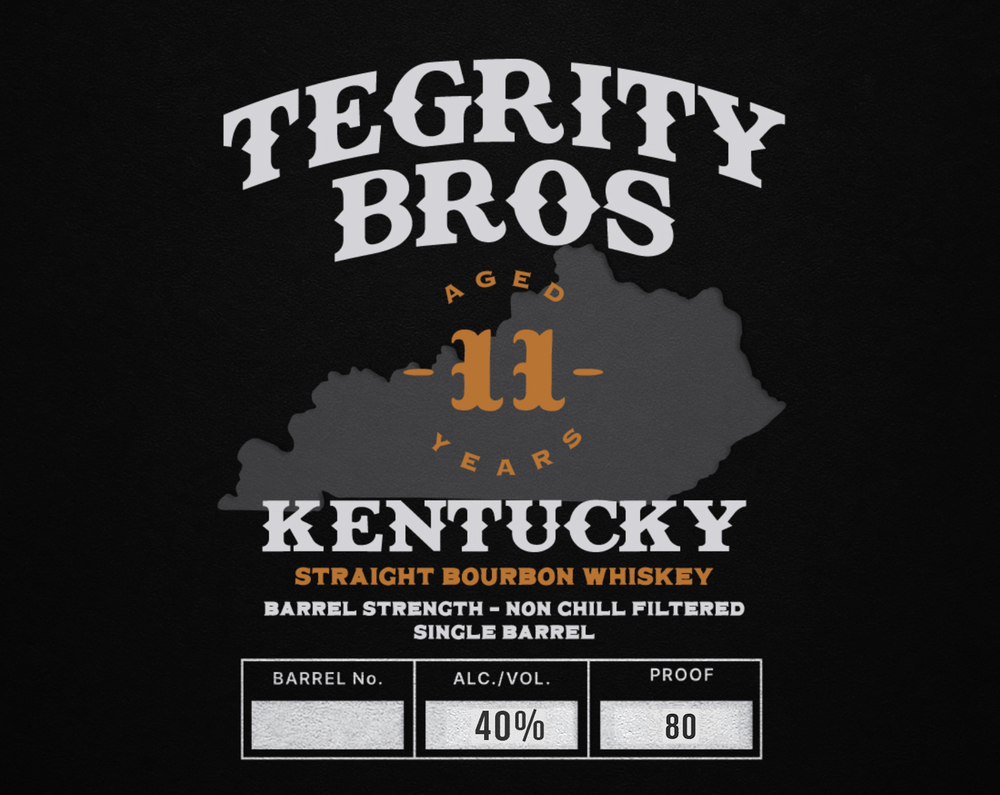

# TTB COLA Label Images - TTBID 26155001000566

**Brand Name:** TEGRITY BROS

**Issue Date:** 06/10/2026

**Origin Code:** 22

**Product Class/Type:** 101

**Source:** [TTB Public COLA Registry](https://ttbonline.gov/colasonline/viewColaDetails.do?action=publicFormDisplay&ttbid=26155001000566)

## Label Images

### Back Label

### Front Label

## Extracted Label Text

*Text extracted via OCR - may contain errors*

**Detected Proof:** 80

### Back Label

AMERICAN
TEGRITY
BROS
KENTUCKY
STRAIGHT BOURBON WHISKEY
2
BARREL STRENCTH - NON CHILL FILTERED
SINGLE BARREL
Bottled by American Bourbon Company
Shelbyville, Kentucky DSP-KY-2OIL
Kentucky
Proud
Distilled in
Kentucky
GOVERNMENT WARNING:
According to the Surgeon General, women should not
drink alcoholic beverages
pregnancy because of
750
the risk of birth defects: (2) Consumption of alcoholic
ML
beverages impairs your ability to drive & car Or operale
machinery; and may cause health problems:
COMPANY
BOURBON
WISH
KEY

Co M P P
during

### Front Label

TEGRITY
BROS
6 E
11-
E A R
KENTUCKY
STRAIGHT BOURBON WHISKEY
BARREL STRENCTH
NON CHILL FILTERED
SINGLE BARREL
BARREL No.
ALC IVOL.
PROOF
40%
80
