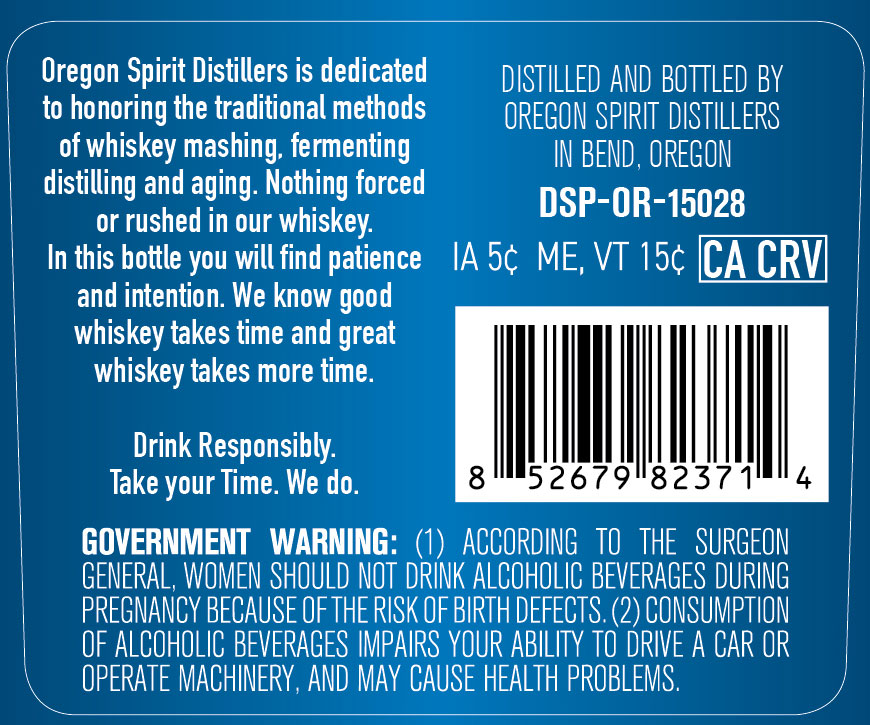
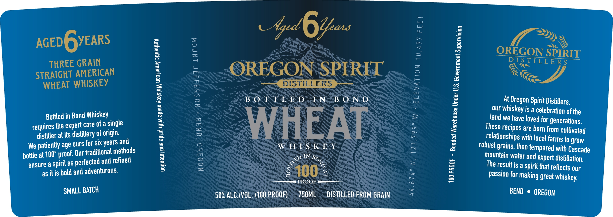

# TTB COLA Label Images - TTBID 26155001000569

**Brand Name:** OREGON SPIRIT DISTILLERS

**Issue Date:** 06/12/2026

**Origin Code:** 38

**Product Class/Type:** 119

**Source:** [TTB Public COLA Registry](https://ttbonline.gov/colasonline/viewColaDetails.do?action=publicFormDisplay&ttbid=26155001000569)

## Label Images

### Back Label

### Front Label

### Label 2

## Extracted Label Text

*Text extracted via OCR - may contain errors*

*1 image(s) excluded: text did not meet readability threshold*

**Detected Proof:** 100

### Back Label

Oregon Spirit Distillers is dedicated
DISTILLED AND BOTTLED BY
to
honoring the traditional methods
OREGON SPIRIT DISTILLERS
of whiskey mashing; fermenting
IN BEND , OREGON
distilling and aging: Nothing forced
DSP-OR-15028
or rushed in our whiskey:
In this bottle you will find patience
IA 5c ME, VT 15c [CA CRVL
and intention. We know
whiskey takes time and great
whiskey takes more time:
Drink Responsibly:
Take your Time. We do.
8
526
9
8237
GOVERNMENT
WARNING:
ACCORDING   tO  THE   SURGEON
GENERAL, WOMEN SHOULD NOT DRINK ALCOHOLIC BEVERAGES DURING
PREGNANCY BECAUSE OFTHE RISK OF BIRTH DEFECTS. (2) CONSUMPTION
OF ALCOHOLIC BEVERAGES IMPAIRS YOUR ABILITY to DRIVE A CAR OR
OPERATE MACHINERY, AND May CAUSe HEALTH PROBLEMS .
good

### Front Label

a

i:

: ¢

22)

Aged

6

“ae

x

»)

AGED GYEARS

OREGON SPIRIT

DIS TTY ERS

THREE GRAIN

—N en

"=

STRAIGHT AMERICAN

OREGON SPIRED

W

WHEAT WHISKEY

pee, DISTILLERS See

ee.

BOTTLED. LNB OND

At Oregon Spirit Distillers,

our whiskey is a celebration of the

Bottled in Bond Whiskey

land we have loved for generations.

requires the expert care ofa single

distiller at its distillery of origin.

WHEAT

These recipes are horn from cultivated

age ours for six years and

WH TS KEY

relationships with local farms to grow

We patiently

f. Our traditional methods

robust grains, then tempered with Cascade

hottle at 100° proo

IN 46,

mountain water and expert distillation.

ensure a spirit as perfe

cted and refined

The result is a spirit that reflects our

as itis bold and adventurous.

4

00 ;

PROOF.

passion for making great whiskey,

SMALL BATCH

50% ALC/VOL: (100 PROOF)

750M

DISTILLED FROM GRAIN

BEND © OREGON
