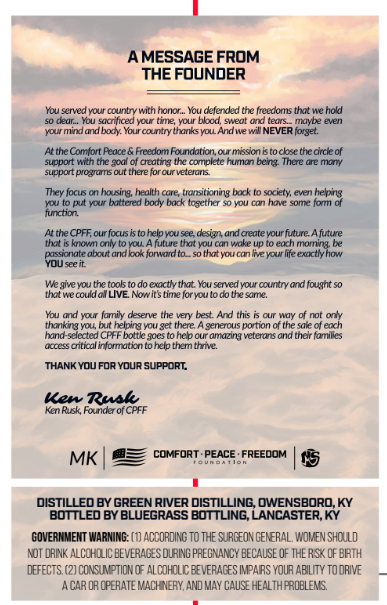
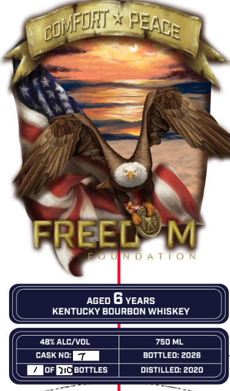

# TTB COLA Label Images - TTBID 26155001000572

**Brand Name:** FREEDOM FOUNDATION

**Issue Date:** 06/09/2026

**Origin Code:** 22

**Product Class/Type:** 101

**Source:** [TTB Public COLA Registry](https://ttbonline.gov/colasonline/viewColaDetails.do?action=publicFormDisplay&ttbid=26155001000572)

## Label Images

### Back Label

### Front Label

### Label 3

## Extracted Label Text

*Text extracted via OCR - may contain errors*

*1 image(s) excluded: text did not meet readability threshold*

**Detected Age:** 6 Years

### Back Label

A MESSAGE FROM
THE FouNdER
tou srved vuulr cunbny WiLh forior_ YoU delended tre frexdorns thtt ue holl
deur
scccedenrtin
Mounhbod sentontent
nnaaaen
poumind and body: Your courtrythanksYlL Arid ue WINEVER forget
pt the Comtort Feace
Freedom Fouridation aur mssonistocbse the arck of
slDpot Win tIc so
OrutaUC coMDILtC Gurnon bcna
Incn: &rt MMn=
SlDpon ploznns Out [NEre t0rcur VEtelons
Tey focr
hxring health care; tanssitiorling bxk (0 sxciety; ewen hekarg
puvolhutend hoc
buck tcjetl
Hnu mrn hc cnmamn
humction
At the CPFF our focus Isto helpcuste design anddente
wour future A future
knovm Gily tomou Afutue thit wou can viakr Up to erxh (rnn
pusnate about
lononiamto
sothnyu cunnelulie &ukt now
tuuseCI
We @ievouthe took to do exctlythat
You scrved vol cty 1d fougnt $0
tuvecoukalLIVE Worits tirne for mulotb the sarrie:
You md jar fami}
eren
And this
Cur May 06 nOc
[arlrnYM tnelpmakou 8e [ire Hcencrous
;portion of the sale of ech
hnd-sclected CFFF bottk ;cs to hcb our andzing veterns and thekr fanles
atessOlical inlommotintohelp tmtme
THANK You For your suppor
Ken Rualk
KnRusk Fourider of CPFF
MK
comfoRT: peacE_
FREEDOM
15
DISTILLED BY GREEN RIVER DISTILLING; OWENSBORO, KY
bottLed BY BLVEGRASS BOTTLING; LANCASTER KY
GOVERMMENT WARNING: (1) ACCORDING T0 the SurGEON CERERAL, vXoMEN ShClld
Koi DRINK ALCCHILIC BEVERAGIS@uRING PREGKANCY BECAUSE OF THERS< OF BRTH
DFFECTS (2) CONSIMPTION Q AL COHOLC EEVERACES IMPPARS YOUR ABILITY TO ORIVE
CAR DR CFERATE MACHNERY, AND MAY CAVSE HEALThROBLENG:

### Front Label

FREEL
M
D A T | 0 N
AGED
6 YEARS
KENTUCKY BOURBON WHISKEY
48* ALC/VOL
750 ML
CASK NO:
bottLed: 2026
oF DIC BOTTLES
distilLed: 2020
coFofIT
PEACE
