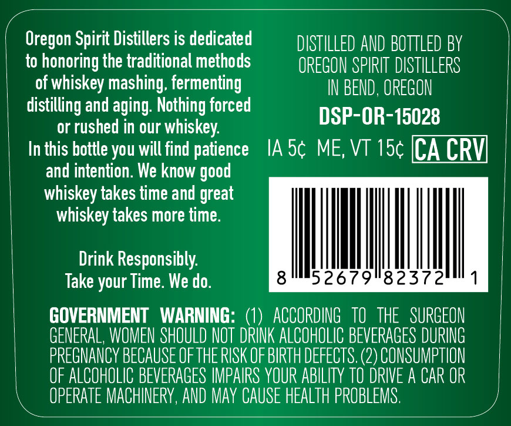
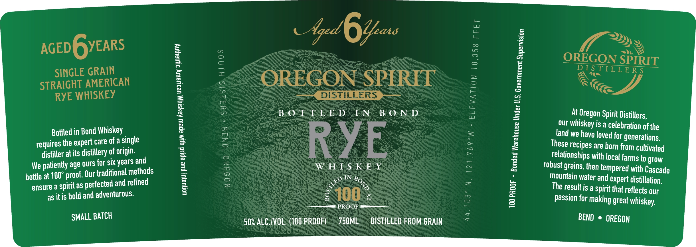

# TTB COLA Label Images - TTBID 26155001000578

**Brand Name:** OREGON SPIRIT DISTILLERS

**Issue Date:** 06/12/2026

**Origin Code:** 38

**Product Class/Type:** 112

**Source:** [TTB Public COLA Registry](https://ttbonline.gov/colasonline/viewColaDetails.do?action=publicFormDisplay&ttbid=26155001000578)

## Label Images

### Back Label

### Front Label

### Label 2

## Extracted Label Text

*Text extracted via OCR - may contain errors*

*1 image(s) excluded: text did not meet readability threshold*

**Detected Proof:** 100

### Back Label

Oregon Spirit Distillers is dedicated
DISTILLED AND BOTTLED BY
to honoring the traditional methods
OREGON SPIRIT DISTILLERS
of whiskey mashing; fermenting
IN BEND , OREGON
distilling and aging: Nothing forced
DSP-OR-15028
or rushed in our whiskey:
In this bottle you will find patience
IA 5c ME, VT 15c [CA CRV]
and intention. We know
whiskey takes time and great
whiskey takes more time:
Drink Responsibly:
Take your Time. We do.
8
52679182372
GOVERNMENT
WARNING:
ACCORDING  TO   THE   SURGEON
GENERAL, WOMEN SHOULD NOT DRINK ALCOHOLIC BEVERAGES DURING
PREGNANCY BECAUSE OFTHE RISK OF BIRTH DEFECTS; (2) CONSUMPTION
OF ALCOHOLIC BEVERAGES IMPAIRS YOUR ABILITY tO DRIVE A CAR OR
OPERATE MACHINERY,AND May CAUSE HEALTH PROBLEMS .
good

### Front Label

a

Aged

6

ae

ay )

AGED GYEARS

OREGON SPIRIT

DISTILLER Sa

SINGLE GRAIN

(Ass

STRAIGHT AMERICAN

OREGON SPIRIT

"&

RYE WHISKEY

op DI STILLERS eee

Kes

BOLTEFLED IN BOND

At Oregon Spirit Distillers,

our whiskey is a celebration of the

Bottled in Bond Whiskey

land we have loved for generations.

requires the expert care ofa single

These recipes are horn from cultivated

distiller at its distillery of origin.

RYE

ently age ours for six years and

WHISKEY

relationships with local farms to grow

We pati

robust grains, then tempered with Cascade

bottle at 1

00° proof. Our traditional methods

SS

DIN 26

mountain water and expert distillation.

ensure a spirit as pel

rfected and refined

The resuttis a Spirit that reflects our

as itis bold and adventurous.

£100

:

—— PROOF ———

Passion for making great whiskey,

SMALL BATCH

50% ALC/VOL, (100 PROOF)

750ME

DISTILLED FROM GRAIN

BEND © OREGON
