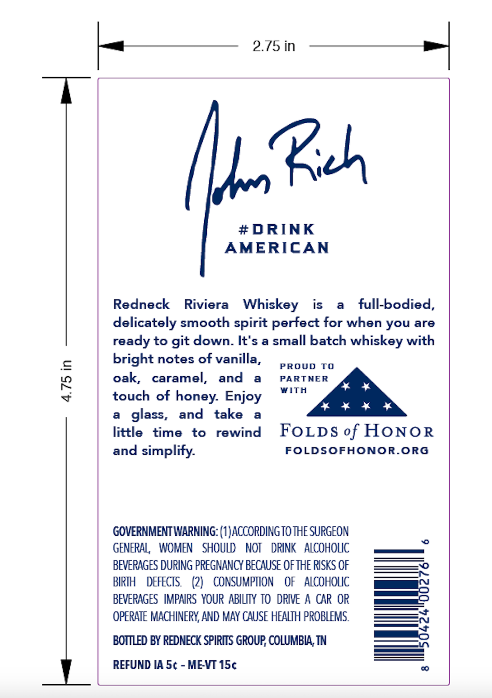
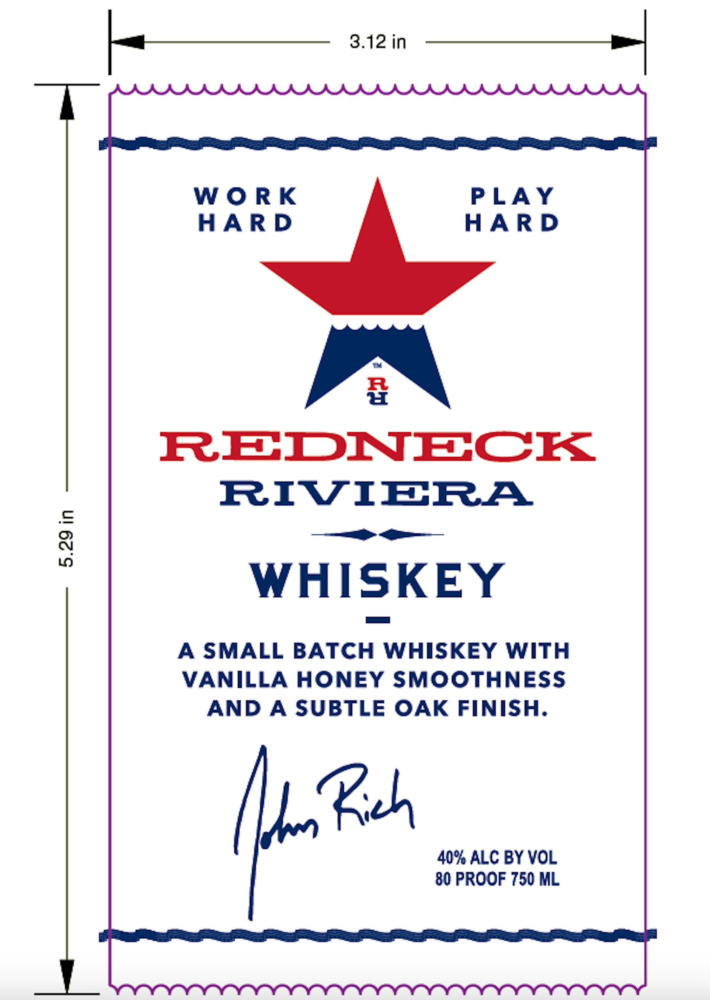
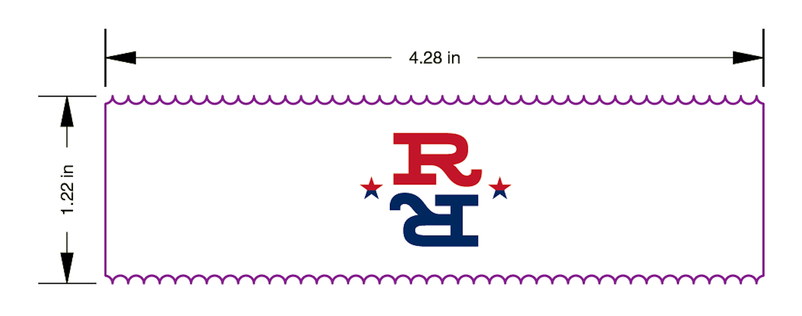

# TTB COLA Label Images - TTBID 26155001000729

**Brand Name:** REDNECK RIVIERA

**Fanciful Name:** ORIGINAL

**Issue Date:** 06/09/2026

**Origin Code:** 43

**Product Class/Type:** 140

**Source:** [TTB Public COLA Registry](https://ttbonline.gov/colasonline/viewColaDetails.do?action=publicFormDisplay&ttbid=26155001000729)

## Label Images

### Back Label

### Front Label

### Label 3

## Extracted Label Text

*Text extracted via OCR - may contain errors*

*1 image(s) excluded: text did not meet readability threshold*

**Detected Proof:** 80

### Back Label

Yan Bich

#DRINK

AMERICAN

Redneck Riviera Whiskey

is a full-bodied,

delicately smooth spirit perfect for when you are

ready to git down. It's a small batch whiskey with

bright notes of vanilla,

PROUD TO

PART

oak, caramel, and a

WITH

touch of honey. Enjoy

a glass, and take a

little time to rewind FOLDS of HONOR

FOLDSOFHONOR.ORG

and simplify.

GOVERNMENT WARNING: (1) ACCORDING TO THE SURGEON

GENERAL, WOMEN SHOULD NOT DRINK ALCOHOLIC

BEVERAGES DURING PREGNANCY BECAUSE OF THE RISKS OF

BIRTH DEFECTS. (2) CONSUMPTION OF ALCOHOLIC

—

BEVERAGES IMPAIRS YOUR ABILITY TO DRIVE A CAR OR

OPERATE MACHINERY, AND MAY CAUSE HEALTH PROBLEMS.

BOTTLED BY REDNECK SPIRITS GROUP, COLUMBIA, TN

REFUND IA 5¢ - ME-VT 15¢

### Front Label

WORK

PLAY

HARD

HARD

u

REDNECK

RIVIBRA

= it

WHISKEY

A SMALL BATCH WHISKEY WITH

VANILLA HONEY SMOOTHNESS

AND A SUBTLE OAK FINISH.

Ya Reh

40% ALC BY VOL

80 PROOF 750 ML
