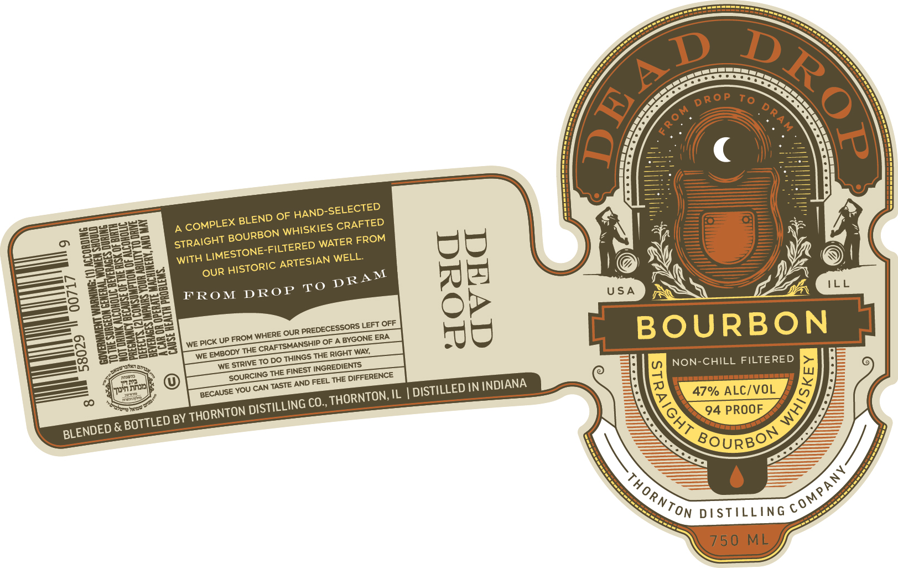

# TTB COLA Label Images - TTBID 26155001000863

**Brand Name:** DEAD DROP

**Issue Date:** 06/25/2026

**Origin Code:** 04

**Product Class/Type:** 101

**Source:** [TTB Public COLA Registry](https://ttbonline.gov/colasonline/viewColaDetails.do?action=publicFormDisplay&ttbid=26155001000863)

## Label Images

### Label 1

## Extracted Label Text

*Text extracted via OCR - may contain errors*

**Detected Proof:** 94

### Label 1

To
OF
~SELECTED
BLEND
CRAFTED
WATER
WITH
WELL
OUR
M
FROM
DROP
%
USA
OUR
Left OFF
BOURBON
PIcK UP FROM WHERE
BYGONE ERA
WE
WAY;
WE
To DO THINGS THE
NON-CHILL FILTERED
WE
THe
DIFFERENCE
hnk
YOU CAN
AND FEEL
IN INDIANA
47% ALC/VOL
IL
CO ,
94 PROOF
BY
&
BOURBOD
DSTLLING
750 ML
(
5
Drop
DRAM
FroM
HAND--
COMPLEX
WHISKIES
BOURBON
FROM
STRAIGHT
LIMESTONE-FILTERED
ARTESIAN
HISTORIC
DRA
To
PREDECESSORS
3
CRAFTSHANSHIP
THE
EMBODY
RIGHT
)
STRIVE
INGREDIENTS
({
340717*47
FINEST
SOURCING
THE
TASTE
DISTILLED
BECAUSE
THORNTON;
Tuenn
DISTILLING
'D72-
Iaro
THORNTON
BOTTLED
BLENDED
cOMPANY
Thornton
