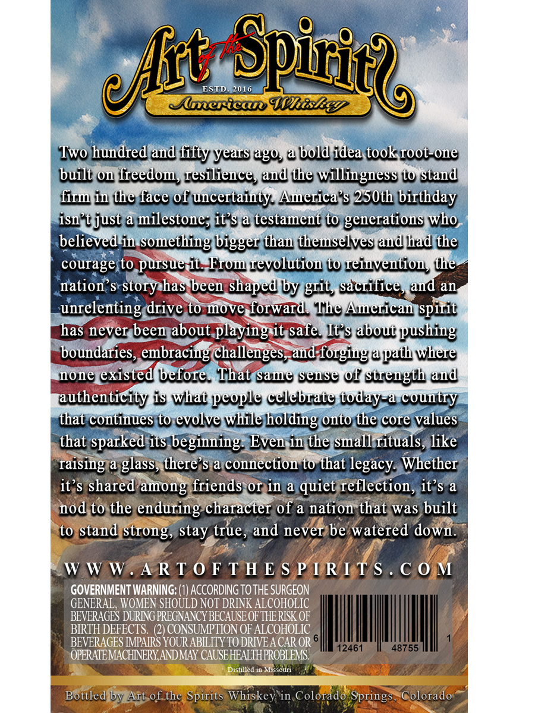
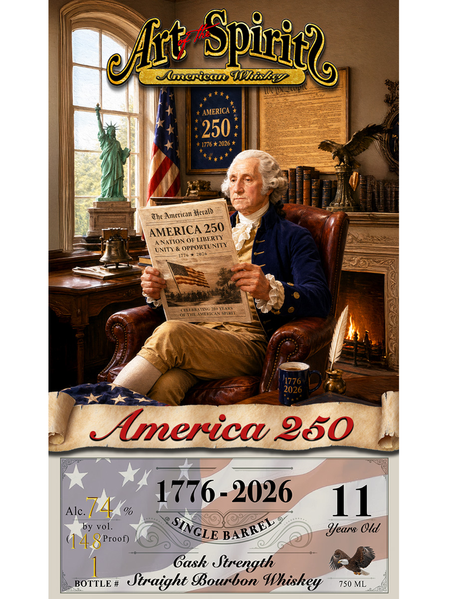

# TTB COLA Label Images - TTBID 26156001000016

**Brand Name:** ART OF THE SPIRITS AMERICAN WHISKEY

**Fanciful Name:** AMERICA 250

**Issue Date:** 06/10/2026

**Origin Code:** 13

**Product Class/Type:** 101

**Source:** [TTB Public COLA Registry](https://ttbonline.gov/colasonline/viewColaDetails.do?action=publicFormDisplay&ttbid=26156001000016)

## Label Images

### Back Label

### Front Label

## Extracted Label Text

*Text extracted via OCR - may contain errors*

### Back Label

eft
ESTD
Spiric2a
2014
lcexican IDKiSEeV
Two hundred and fifty years ag0, @ bold idea tookroot-one
built O. freedomy resilieuce, and the willingness tO stand
firw iw the face of uncertainty_ Aqerica'$ 250th birthday
isn't just a milestone; it'$ a testament to generations who
believed in something bigger than theuselves aud had the
courage to pursue-it_FIOw vevolution tO reinvention the
nation'$ story has been Shaped by grit, Sacrifice, aud an
unrelenting drive to move forward  The Aqerican spirit
has never been about playing it safe It's about pushing
boundaries, embracing challenges,and forgiug a
where
none existed bbefore  That Same seuse of strength aud
authenticity is What people celebrate today-& country
that continues to evolve while
holding onto the core Values
that sparked its beginning Even in the small rituals, like
Taising a glass, there s a connection t0 that legacy Whether
it'$ shared among friends OT in a
Teflection, it'$ a
nod to the enduring character of a nation that was built
to stand strong, stay true, and never be watered down.
WW W. A RT0 F TH E S P IRITS . € 0 M
GOVERNMENT WARNING: (1) ACCORDING TOTHE SURGEON
GENERAL , WOMEN SHOULD NOT DRINK ALCOHOLIC
BEVERAGES DURING PREGNANCY BECAUSE OF THERISK OF
BIRTH DEFECTS. (2) CONSUMPTION OF ALCOHOLIC
BEVERAGES IMPAIRS YOUR ABILITY TO DRIVEA CAR OR '
12461
48755
OPERATEMACHINERYANDMAY CAUSEHEALIHPROBLEMS
Distilled
Missouri
Bottled by Art of the Spirits Whiskey in Colorado Springs
Colorado
ppath -
quiet

### Front Label

Spicic2a
Alericdn UkisE:
'AMERICA
250
1776 * 2026
Che American Zieralb
AMERICA 250
ANATION OE LIBERTY
UNITY
OPPORTUNITY
1010
CELERRATIXG EJu NEARS
OF ThL AMIERICAN Spirit
'1776
2026
~merica %50
Alc.
74
%f
1776-2026
11
by vol.
Iears Old
(1 4 8 Proof)
Gask Strength
BOTTLE #
Straight IBourbon
750 ML
elt
SINGLE
BARREL
Whiskey
