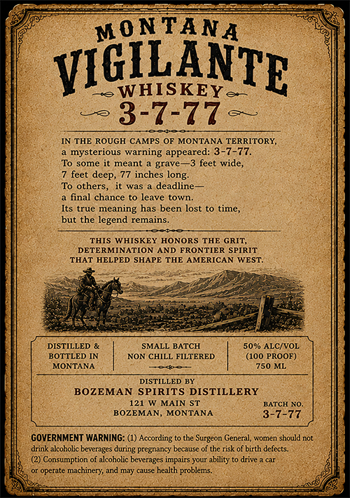
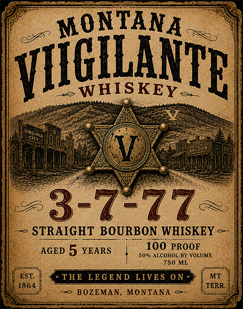

# TTB COLA Label Images - TTBID 26156001000083

**Brand Name:** MONTANA VIGILANTE WHISKEY V 3-7-77

**Issue Date:** 06/14/2026

**Origin Code:** 30

**Product Class/Type:** 101

**Source:** [TTB Public COLA Registry](https://ttbonline.gov/colasonline/viewColaDetails.do?action=publicFormDisplay&ttbid=26156001000083)

## Label Images

### Back Label

### Front Label

## Extracted Label Text

*Text extracted via OCR - may contain errors*

**Detected Proof:** 100
**Detected Age:** 5 Years

### Back Label

MONTANA
VIGTLANTE
WHISKEYe
3-7-77
IN THE ROUGH CAMPS OF MONTANA TERRITORY,
mysterious warning appeared: 3-7-77.
To some it meant
grave
3 feet wide,
feet deep,
77 inches long:
To others,
it was
deadline
final chance
leave town_
Its true meaning has been lost to time,
but the legend remains_
THIS WHISKEY HONORS THE GRIT;
DETERMINATION
AND FRONTIER SPIRIT
THAT HELPED SHAPE THE AMERICAN WEST:
DISTILLED
SMALL BATCH
50%0 ALCIVOL
BOTTLED IN
NON CHILL FILTERED
(100 PROOF)
MONTANA
750 ML
DISTILLED BY
BOZEMAN SPIRITS DISTILLERY
121 W MAIN ST
BATCH NO_
BOZEMAN,
MONTANA
3-7-77
GOVERNMENT WARNING: (1) According to the Surgeon General,
acoTne
should not
drink akcoholic beverages during pregnancy because of the risk of birth defects:
Consumption of akcoholic beverages impairs your ability
drive
operate machinery; and may
Da
health problems_

### Front Label

MONTANA
VIIGIHWVIB
WHISKEYe
3-7-77
STRAIGHT BOURBON WHISKEY
AGED 5 YEARS
100 PROOF
50% ALCOHOL BY VOLUME
750 ML
EST:
THE LEGEND LIVE S
0N .
MT
1864
TERR
BOZEMAN,
MONTANA
Vaginin
Saloon
