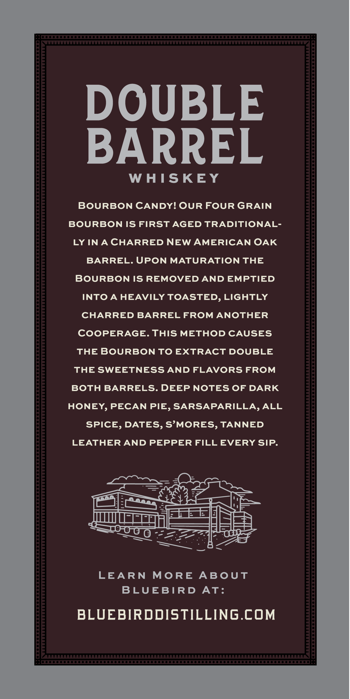

# TTB COLA Label Images - TTBID 26156001000107

**Brand Name:** BLUEBIRD DISTILLING

**Fanciful Name:** DOUBLE BARREL

**Issue Date:** 06/22/2026

**Origin Code:** 39

**Product Class/Type:** 101

**Source:** [TTB Public COLA Registry](https://ttbonline.gov/colasonline/viewColaDetails.do?action=publicFormDisplay&ttbid=26156001000107)

## Label Images

### Back Label

## Extracted Label Text

*Text extracted via OCR - may contain errors*

### Back Label

DOUBLE
BARREL
WHISKEY
BOURBON CANDY! OUR FOUR GRAIN
BOURBON IS FIRST AGED TRADITIONAL-
LY INA CHARRED NEW AMERICAN OAK
BARREL. UPON MATURATION THE
BOURBON IS REMOVED AND EMPTIED
INTO A HEAVILY TOASTED, LIGHTLY
CHARRED BARREL FROM ANOTHER
COOPERAGE_
THIS METHOD CAUSES
THE BOURBON TO EXTRACT DOUBLE
THE SWEETNESS AND FLAVORS FROM
BOTH BARRELS. DEEP NOTES OF DARK
HONEY, PECAN PIE, SARSAPARILLA, ALL
SPICE, DATES, S'MORES, TANNED
LEATHER AND PEPPER FILL EVERY SIP
LEARN
MoRE
ABOUT
BLUEBTRD
At:
BLUEBIRDDISTILLING.COM
