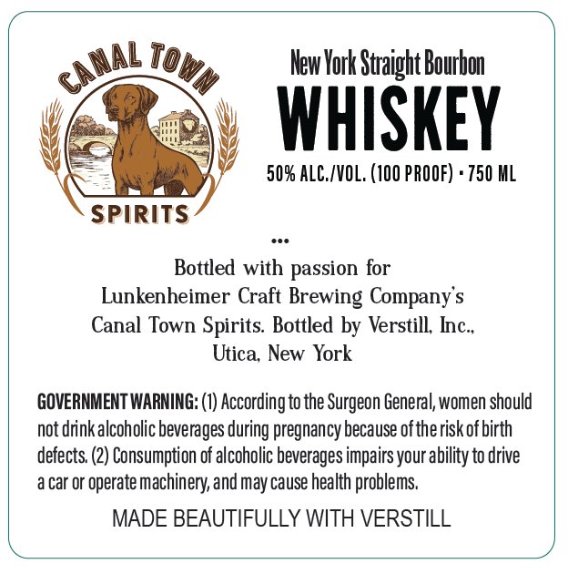
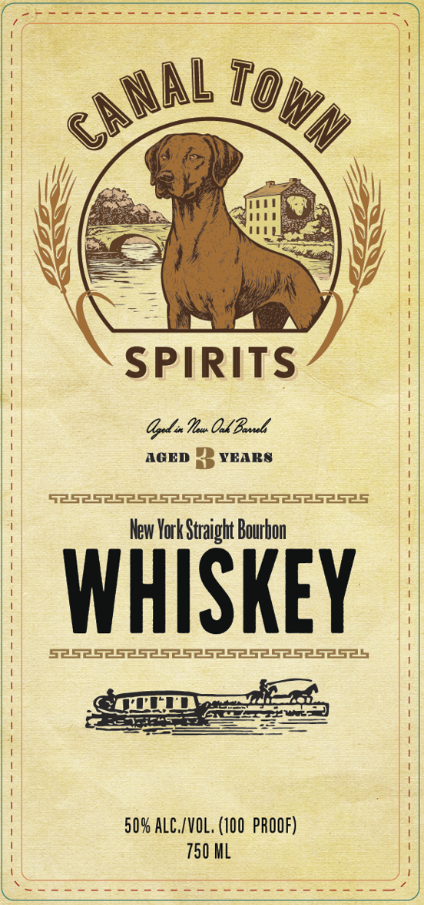

# TTB COLA Label Images - TTBID 26156001000191

**Brand Name:** CANAL TOWN

**Issue Date:** 06/18/2026

**Origin Code:** 02

**Product Class/Type:** 101

**Source:** [TTB Public COLA Registry](https://ttbonline.gov/colasonline/viewColaDetails.do?action=publicFormDisplay&ttbid=26156001000191)

## Label Images

### Back Label

### Label 1

## Extracted Label Text

*Text extracted via OCR - may contain errors*

**Detected Proof:** 100

### Back Label

New York Straight Bourbon
WHISKEY
50% ALC_/VOL, (10O PROOF) + 750 ML
SPIRITS
Bottled with passion for
Lunkenheimer Craft Brewing Company s
Canal Town Spirits. Bottled by Verstill Inc_
Utica New York
GOVERNMENT WARNING: (1) According to the Surgeon General, women should
not drinkalcoholic beverages during pregnancy because oftherisk of birth
defects: (2) Consumption of alcoholic beverages impairs your ability to drive
a car Or
'operate machinery,and may cause health problems
MADE BEAUTIFULLY WITH VERSTILL
canaL
TOWm

### Label 1

SPIRITS
OyI Ih OL Bl
AGED
YEARS
52525252525252525252525
lew York Straight Bourbon
WHISKEY
509 ALC./VOL, (100 PROOF)
750 ML
CA NAL
TOWn
