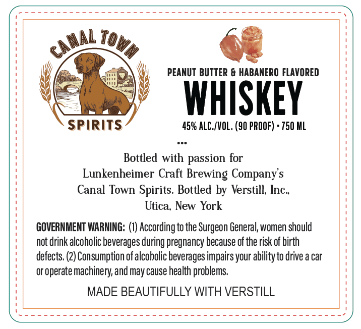
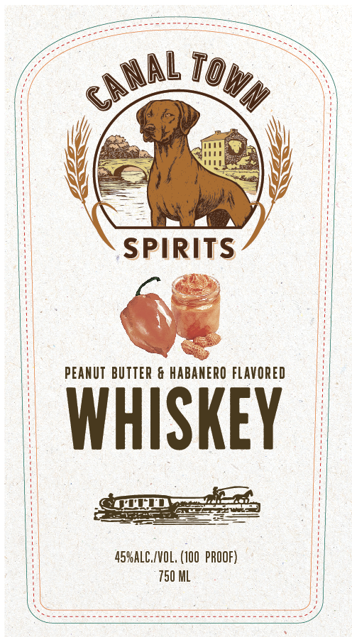

# TTB COLA Label Images - TTBID 26156001000200

**Brand Name:** CANAL TOWN

**Issue Date:** 06/17/2026

**Origin Code:** 02

**Product Class/Type:** 149

**Source:** [TTB Public COLA Registry](https://ttbonline.gov/colasonline/viewColaDetails.do?action=publicFormDisplay&ttbid=26156001000200)

## Label Images

### Back Label

### Front Label

## Extracted Label Text

*Text extracted via OCR - may contain errors*

**Detected Proof:** 90

### Back Label

To
PEANUT BUTTER & HABANERO FLAVORED
WHISKEY
SPIRITS
459 ALC /VOL, (90 PROOF) + 750 ML
Bottled with passion for
Lunkenheimer Craft Brewing Company s
Canal Town Spirits Bottled by Verstill; Inc-
Utica, New York
GOVERNMENT WARMNG: (I) According to the Surgeon General,women should
not drink alcoholic beverages during pregnancy because of the risk of birth
defects. (2) Consumption ofalcoholic beverages impairs your abilityto drive a car
or operate machinery, and may cause health problems
MADE BEAUTIFULLY WITH VERSTILL
canal
Wn

### Front Label

Srey

faeteoai ats

Ge oni Oy, >

/

\

(

——

mm a A

ane

PEANUT BUTTER & HABANERO FLAVORED

PRE

SELL 8)

=

prez

a

Ho PROOF)

SEE ye AE Coe ORT SE Pee R aT
